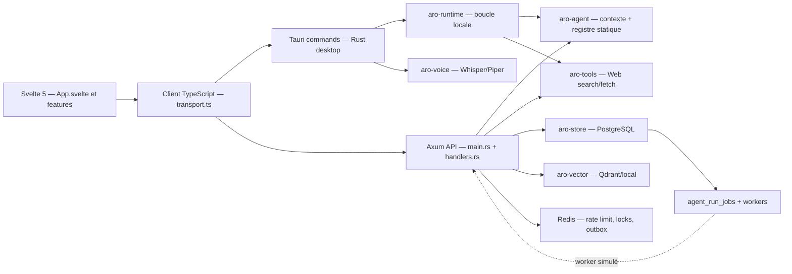
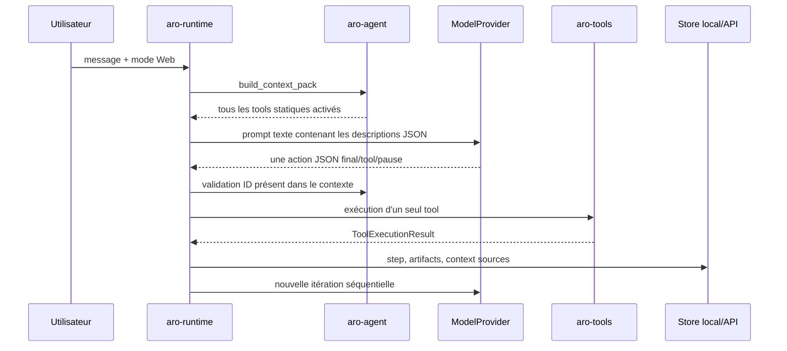

# Audit du système d'exécution agent — juillet 2026

## Verdict

ARO possède plusieurs fondations sérieuses, mais pas encore une couche d'exécution unifiée. Le produit est aujourd'hui composé de trois chemins partiellement indépendants :

1. un runtime agent local, linéaire et limité à deux outils Web réellement exécutables ;
2. une API cloud qui persiste des runs et peut effectuer des enrichissements Web immédiats ;
3. une queue PostgreSQL récente, robuste sur les leases et les budgets, mais non raccordée au point d'entrée principal et exécutée par un worker encore simulé.

La bonne stratégie n'est ni de remplacer PostgreSQL par un moteur de workflow externe, ni de transformer immédiatement le monolithe en microservices. La cible recommandée est un monolithe modulaire pour le control plane, des workers séparés pour l'exécution durable et un exécuteur edge explicite pour les capacités locales. PostgreSQL reste la source de vérité ; Redis reste un accélérateur non durable.

L'exposition publique doit rester bloquée tant que les points P0 ci-dessous ne sont pas corrigés. En particulier, le contrôle de domaines Web est actuellement inversé dans `aro-tools`, le worker agent produit une réponse simulée, le point d'entrée agent n'alimente pas la queue durable, et les contrôles Rust/frontend ne sont pas verts.

## Méthode et état initial

L'audit a été réalisé en lecture source, puis confronté aux documents existants. Les documents `BACKEND_AUDIT_2026-07.md`, `BACKEND_TARGET_ARCHITECTURE.md` et `BACKEND_MIGRATION_PLAN.md` contiennent de bonnes décisions, mais ils sont déjà partiellement dépassés par les migrations et modules ajoutés ensuite.

Le dépôt ne contient encore aucun commit et tous les fichiers apparaissent non suivis. Il n'existe donc pas de base Git fiable permettant d'attribuer une régression à un changement précis. Les mesures ci-dessous constituent le baseline observé :

| Vérification | Résultat initial | Preuve |
| --- | --- | --- |
| `npm run test:unit` | 76 tests réussis | 10 fichiers Vitest |
| `npm run check` | échec | `DEFAULT_SETTINGS` absent dans `apps/desktop/src/lib/api/transport.ts:344` |
| `cargo test -p aro-tools` | échec de compilation | fixtures `WebAccessPolicy` incomplètes à `crates/aro-tools/src/lib.rs:1371` et `:1383` |
| `cargo check --workspace` | échec observé pendant l'audit | appel worker d'intégration incohérent avec l'état source observé ; le fichier a changé pendant la mesure et doit être revalidé avant modification |

Quatre fichiers concentrent une part disproportionnée du comportement :

| Fichier | Taille observée | Risque |
| --- | ---: | --- |
| `crates/aro-store/src/lib.rs` | ~12 347 lignes | persistence, transactions et domaines trop couplés |
| `apps/desktop/src/App.svelte` | ~8 596 lignes | état global, orchestration UI et vues entremêlés |
| `apps/api/src/handlers.rs` | ~4 467 lignes | transport, use cases et orchestration dans le même module |
| `apps/desktop/src-tauri/src/main.rs` | ~2 713 lignes | commandes, runtime local, secrets et bridge trop concentrés |

## Cartographie actuelle

### Frontend et desktop

- Svelte 5 porte l'interface principale. Des composants `features/*` existent, mais `App.svelte` conserve encore l'essentiel de l'état, des appels, des libellés, des modales et des transitions.
- `apps/desktop/src/lib/api/transport.ts` choisit Tauri, API Web ou fallback de démonstration. Cette façade est utile pour la compatibilité, mais mélange normalisation, stockage de session, appels HTTP, mocks et logique métier.
- Tauri garde les refresh tokens et secrets de fournisseurs dans le keyring, et expose les runtimes locaux. Cette frontière est saine et doit être conservée.
- Les réglages visibles couvrent déjà modèle, voix, mémoire, permissions, plugins, skills, MCP, hooks, monitoring et organisations. Plusieurs écrans ne pilotent cependant que du CRUD de métadonnées, pas une capacité exécutable réelle.
- Les confirmations sensibles sont ponctuelles et UI-spécifiques, par exemple `confirm(...)` pour la suppression MCP dans `App.svelte:2352`. Il n'existe pas de protocole de confirmation backend lié au contenu exact d'une action.

### Backend et données

- Axum expose un contrat `/v1` et une façade historique. `apps/api/src/main.rs:986-1313` assemble les routes.
- `aro-store` fournit PostgreSQL, migrations SQLx, auth, tenants, conversations, mémoire, fichiers, agents, intégrations, audit et outbox.
- Redis est correctement traité comme coordination temporaire : rate limiting, verrous courts et publication rapide de l'outbox.
- Des rôles base distincts API/worker/migration et des contrôles de démarrage existent.
- Les politiques RLS sont définies pour conversations, messages et mémoires, mais la migration `202607020011_private_data_rls_policies.sql:1-12` indique explicitement qu'elles ne sont pas activées. L'isolation repose donc encore principalement sur les filtres applicatifs.
- L'outbox, les événements d'audit et plusieurs opérations de fichier sont transactionnels, mais cette discipline n'est pas encore uniforme sur toutes les mutations.

### Authentification et utilisateurs

- Argon2, JWT tenant-scopé, rotation sérialisée des refresh tokens, détection de replay, familles à durée absolue et keyring desktop constituent une bonne base.
- Le switch d'organisation fait tourner le refresh token, ce qui évite un simple header tenant falsifiable.
- Il manque encore MFA, SSO/OIDC complet, reset de mot de passe, révocation immédiate des access tokens et console de sessions/appareils.
- RBAC d'organisation et contrôles d'ownership coexistent. Il n'existe pas encore de moteur ABAC transversal pour tools, données, destinations et niveau de risque.

### Jobs, workers, cache et services externes

- Les scans de fichiers et livraisons d'invitations utilisent des leases et des retries bornés.
- `agent_run_jobs` apporte budgets immuables, snapshot chiffré, priorité avec aging, lease fencing, heartbeat, pause, annulation, retry, reprise après expiration, événements append-only et purge. C'est un socle à conserver.
- `process_agent_jobs` réclame les jobs puis lance un `tokio::spawn` par job (`apps/api/src/agent_runner.rs:19-27`). La concurrence process n'est pas bornée localement.
- Le worker agent construit un `ModelRouter` mais ne l'utilise pas (`agent_runner.rs:83-100`), écrit un faux step de raisonnement et renvoie `Agent completed goal` (`:127-156`).
- Les renewals publient toujours `AgentRunJobUsage::default()` (`:55-56`) ; les budgets de progression ne reflètent donc pas l'usage réel.
- L'entrée `POST /agent/runs` persiste un run et son contexte, mais n'appelle pas `submit_agent_run_job`; les imports correspondants sont inutilisés. La queue durable et l'API principale ne forment pas encore un chemin complet.
- Les intégrations v3 possèdent déjà catalogue, grants, health, jobs et audit. Elles constituent le meilleur modèle existant pour les futures installations de plugins/connecteurs.

### Logs et observabilité

- Les logs `tracing` sont structurables et un `request_id` validé est propagé.
- `/metrics` est protégé en production et Redis expose quelques métriques opérationnelles.
- Les événements de runs durables sont sans contenu sensible et append-only, ce qui est une bonne décision.
- Il manque un schéma OpenTelemetry commun, des spans par plan/nœud/tool, des métriques RED/USE, des coûts/tokens fiables, des SLO, alertes et dashboards versionnés.

## Flux tools actuel

### Déclaration et enregistrement

- `ToolRef` ne contient que `id`, `name`, `description`, `source`, `enabled`, `dangerous` et `input_schema` (`crates/aro-core/src/agent.rs:127-137`).
- La requête et le résultat d'exécution sont séparés dans `crates/aro-core/src/tool.rs:21-69`.
- Le registre est un `Vec<ToolRef>` codé en dur dans `crates/aro-agent/src/lib.rs:470-558`.
- Sept tools sont exposés : recherche/fetch Web, recherche/lecture/écriture workspace, shell et artifact. Seuls `web.search` et `web.fetch` sont réellement implémentés dans `aro-tools` (`crates/aro-tools/src/lib.rs:103-114`). Le modèle peut donc sélectionner des tools annoncés mais inexécutables.
- Aucun versionnement, output schema, propriétaire, provenance détaillée, health, timeout par tool, retry, quota, dépendance ou environnement d'exécution ne fait partie du contrat.

### Exposition et sélection par le modèle

- `ContextBuilder` concatène tous les tools built-in activés et les pseudo-tools fournis par les skills (`aro-agent/src/lib.rs:430-458`).
- Les définitions sont rendues comme texte dans le system prompt (`:657-689`) ; elles ne sont pas transmises comme fonctions natives typées au fournisseur.
- La sélection consiste seulement à vérifier que l'ID demandé figurait dans le context pack (`:219-245`).
- Il n'existe ni analyse d'intention, ni recherche par capability, ni ranking, ni limite de contexte par requête, ni filtrage effectif par permission avant exposition.

### Exécution, résultats et erreurs

- La boucle locale effectue au maximum 8 étapes par défaut et 32 au plafond, une action à la fois (`crates/aro-runtime/src/lib.rs:552-686`).
- Les erreurs de tool sont converties en `ToolExecutionResult::Failed`, persistées comme steps, puis réinjectées au contexte.
- Le prefetch de plusieurs URLs est explicitement séquentiel (`aro-runtime/src/lib.rs:694-738`).
- Les résultats transportent sources et artifacts, mais pas coût, tokens, retry count, policy decision, confirmation, output validation ou référence durable normalisée.
- `AgentStep.sequence` impose une timeline linéaire ; il n'existe pas de graphe de dépendances.

### Permissions et egress

- `PermissionProfile` combine racines, domaines et quatre booléens read/write/shell/network (`aro-core/src/agent.rs:141-178`).
- Le contrôle filesystem utilise la canonicalisation et le préfixe de racine ; le shell bloque quelques motifs par heuristique. Ces contrôles sont utiles mais insuffisants comme policy engine général.
- Le direct tool endpoint est masqué par défaut et exige un profil persisté (`apps/api/src/handlers.rs:2238-2277`).
- Défaut critique : `WebAccessPolicy::domain_allowed` applique `!domain_matches_allowlist(...)` dans `crates/aro-tools/src/lib.rs:742-748`. Un domaine autorisé est refusé et un domaine non listé est accepté.
- Défaut critique : l'enrichissement API remplace la politique par `allowed_domains: []` dès qu'un profil quelconque de l'utilisateur autorise le réseau (`apps/api/src/handlers.rs:4025-4035`), sans lier le run à ce profil ni conserver sa liste de domaines.
- Les commentaires `handlers.rs:4157-4161` annoncent « aucun appel implicite », alors que `collect_web_context_for_run` peut réactiver le réseau. Le comportement et la documentation divergent.

## Skills, plugins et MCP

### Skills

- La table `skills` stocke nom, description, triggers, kind, content et enabled (`202607010001_initial_postgres.sql:190-205`).
- Les endpoints utilisent essentiellement le CRUD JSON générique (`handlers.rs:3324-3362`).
- Une skill n'a pas de contrat d'input/output, workflow, outils autorisés, permissions, validations, critères de succès, dépendances ou version.
- Aucun compilateur de skill ne transforme actuellement une skill persistée en plan exécutable. Dans le runtime local, les skills sont seulement acceptées comme `ToolRef`; les appels observés leur passent généralement une liste vide.

### Plugins et intégrations

- Le modèle historique `plugin_connections` est une connexion générique avec config JSON et secret chiffré.
- L'intégration v3 est nettement plus structurée : définitions de connecteurs, profils clients, installations, credential versions, capability grants, health history, jobs et audit.
- Il manque un package plugin signé, un manifeste versionné, un sandbox, des migrations contrôlées, des ressources/UI, des webhooks typés et un mécanisme de rollback/revocation du code.
- Le futur système de plugins doit réutiliser les installations/grants v3 au lieu d'introduire une troisième notion de connexion.

### MCP

- La table `mcp_servers` conserve transport, commande/args ou URL, env chiffré et snapshots `tools/resources` (`initial_postgres.sql:223-239`).
- L'API expose du CRUD générique (`handlers.rs:3411-3456`).
- Aucun client MCP serveur n'assure aujourd'hui discovery, prompts, resources, capability negotiation, auth, heartbeat, reconnect, version sync ou isolation.
- Aucune règle centrale ne prévient les collisions de noms entre built-ins, plugins, MCP et skills.

## Mémoire et contexte utilisateur

- La mémoire cloud contient contenu, catégorie, scope, status, source messages, salience et last_used. La recherche combine PostgreSQL lexical et vectoriel.
- `memories_search` charge d'abord toutes les mémoires puis les résultats lexicaux avant la fusion vectorielle (`handlers.rs:3258-3290`). Ce chemin ne passe pas à l'échelle.
- La création/mise à jour appelle Qdrant dans le chemin HTTP après l'écriture PostgreSQL (`handlers.rs:3166-3186`, `:3207-3229`). Une panne de projection peut laisser l'API en erreur après commit et doit devenir un job outbox idempotent.
- Il manque TTL, sensibilité, confiance, provenance normalisée, versions, ACL, consentement, contradiction/fusion et export/oubli complets.
- Le modèle n'a pas de service de contexte utilisateur minimal. Les handlers et context builders assemblent directement diverses sources.

## Paramètres et voix

- `user_preferences` contient thème, langue, wake word, inference mode et JSON libre. `app_settings` contient un JSON par user/organisation. `device_settings` existe séparément.
- `AppSettings` mélange sélection de modèle, réglages Web, chemins locaux voix, rétention et lecture vocale (`crates/aro-core/src/settings.rs:437-559`). Les chemins d'exécutables/modèles ne doivent jamais être synchronisés entre appareils.
- Les mises à jour utilisent un remplacement global, sans ETag/version, patch typé par scope, permission fine ou événement standardisé (`handlers.rs:2952-2991`).
- Le runtime voix local Whisper/Piper et les diagnostics privacy-safe constituent une bonne base edge.
- Il manque consentement vocal durable, lifecycle des échantillons, suppression vérifiable, anti-usurpation, abstraction multi-provider et outils agent dédiés.

## Registre des problèmes

### P0 — bloquants sécurité ou intégrité

1. **Allowlist Web inversée** — `aro-tools/src/lib.rs:742-748`.
2. **Réactivation implicite et élargissement de l'egress** — `handlers.rs:4025-4035`.
3. **Run API non raccordé à la queue durable** — `handlers.rs:2528-2690` versus `aro-store/src/agent_jobs.rs:389-674`.
4. **Worker agent simulé mais marquant le job réussi** — `agent_runner.rs:99-156`.
5. **RLS non activé** — migration `202607020011_private_data_rls_policies.sql:1-12`.
6. **Baseline non compilable/non typé** — erreurs listées dans « état initial ».

### P1 — architecture et fiabilité

1. Contrat tool incomplet et registre statique non versionné.
2. Tools exposés mais non exécutables.
3. Absence de DAG, idempotence par nœud, compensation et fan-out/fan-in.
4. Concurrence worker process non bornée et usage/budgets non remontés.
5. Skills/plugins/MCP majoritairement déclaratifs ou CRUD, non exécutables.
6. Confirmations frontend non liées à une policy decision backend.
7. Projections vectorielles synchrones et recherche mémoire chargeant toute la collection.
8. Paramètres multi-scope non modélisés et chemins device dans une forme cloud.
9. Monolithes fichiers/UI qui empêchent l'isolation de tests et d'ownership.
10. Observabilité sans trace distribuée ni coûts fiables.

### P2 — performance, maintenabilité et produit

1. Préchargement Web séquentiel et moteur de recherche mono-provider par appel.
2. Pas de sélection capability-based ; contexte modèle inutilement large.
3. API DTO et types frontend dupliqués, sans OpenAPI généré.
4. Pagination souvent par limite simple, peu d'ETag/optimistic concurrency.
5. États libres dans plusieurs tables historiques.
6. Documentation produit hybride/local encore contradictoire par endroits.

## Conserver, améliorer, supprimer

| Décision | Éléments |
| --- | --- |
| Conserver | PostgreSQL source de vérité, outbox, audit sans contenu sensible, queue agent avec lease fencing, séparation API/worker/migration, keyring desktop, quarantaine fichiers, abstractions ModelProvider/FileStorage/Vector, intégrations v3, Problem Details, `/v1` |
| Améliorer | `aro-core` en contrats stables, `aro-tools` en adapters, queue agent en moteur de DAG, `PermissionProfile` en policy engine, settings en API multi-scope, mémoire en domaine versionné, Tauri en exécuteur edge |
| Déprécier puis supprimer | registre `Vec<ToolRef>` hardcodé, IDs `web.search` non namespacés, tools annoncés sans executor, endpoints CRUD génériques pour skills/plugins/MCP, exécution agent immédiate, réponses worker simulées, secrets ou chemins device dans payloads cloud |

## Conclusion de l'audit

ARO ne doit pas repartir de zéro. Les primitives durables les plus coûteuses — tenant, auth, outbox, jobs, leases, budgets, intégrations, stockage et edge local — existent déjà. La refonte doit poser un contrat unique de capability, une sélection contextuelle, une policy decision vérifiable et un plan d'exécution DAG durable, puis migrer chaque capacité existante derrière ces frontières.
