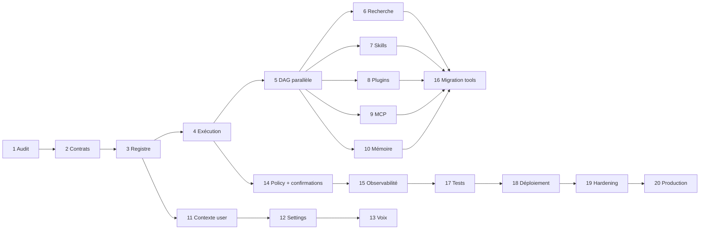

# Plan de refactorisation — ARO Agent OS

## Principes de livraison

- Chaque phase suit `expand → dual-read/dual-write → backfill → verify → cutover → contract`.
- Une phase ne démarre pas si les critères de la précédente ne sont pas mesurés.
- Les flags sont évalués côté backend et versionnés ; le frontend n'est jamais la seule barrière.
- Les migrations destructives sont séparées d'au moins une release de la migration additive.
- Les anciens IDs/routes/DTO restent des aliases instrumentés jusqu'à absence d'usage démontrée.
- Chaque phase livre métriques, alertes, runbook, tests de rollback et décision d'acceptation.

## Vue d'ensemble

## Phase 1 — Audit et cartographie

**Objectif.** Établir la vérité source, le baseline fonctionnel/sécurité/performance et les responsabilités actuelles avant toute réécriture.

**Architecture et composants.** Tout le monorepo ; priorité à `aro-core`, `aro-agent`, `aro-runtime`, `aro-tools`, `aro-store`, `apps/api`, `apps/desktop`, Tauri, migrations et déploiement.

**Fichiers/livrables.** `docs/AGENT_OS_AUDIT_2026-07.md`, `docs/AGENT_OS_TARGET_ARCHITECTURE.md`, ce plan, inventaire des routes/tables/tools et ADR de décisions.

**Interfaces/services/tables/migrations.** Aucun changement runtime. Le schéma et les APIs sont documentés comme baseline.

**Endpoints/événements.** Aucun nouveau contrat ; mesurer l'usage des routes historiques et `/v1`.

**Risques/dépendances.** Absence de commit de référence et modifications concurrentes possibles. Dépend de la stabilisation du worktree et d'une base PostgreSQL de test.

**Tests.** `cargo check/test`, `clippy`, `svelte-check`, Vitest, composants, E2E, smoke API/Redis et mesures de taille/latence.

**Acceptation.** Cartographie validée, baseline horodaté, P0 identifiés, décisions conserver/améliorer/supprimer approuvées.

**Rollback.** Sans objet : documentation uniquement.

## Phase 2 — Définition des contrats

**Objectif.** Introduire les contrats versionnés Tool, Skill, Workflow, Plugin, ExecutionContext, PolicyDecision et Result sans changer le chemin actif.

**Architecture et composants.** Nouveau module `crates/aro-capabilities` ou, première tranche, modules compatibles dans `aro-core`; validation dans une couche sans infrastructure.

**Fichiers.** `crates/aro-core/src/tool.rs`, `agent.rs`, nouveau `capability.rs`; ensuite `crates/aro-capabilities/src/*`; schemas sous `docs/schemas/agent-os/v1/`.

**Nouvelles interfaces/services.** `ToolDescriptor`, `ToolExecutorDescriptor`, `RetryPolicy`, `ToolRisk`, `ToolProvenance`, `SkillManifest`, `PluginManifest`, `ExecutionRequest/Result`; validateurs de namespace/version/schema.

**Tables/migrations.** Aucune table requise pour la première tranche. Préparer `202607..._tool_catalog_expand.sql` uniquement après stabilisation des structs.

**Endpoints/événements.** `GET /v1/meta/agent-os/contracts`; aucun événement métier avant persistance du registre.

**Risques/dépendances.** Rupture serde et duplication avec `ToolRef`. Dépend de tests golden JSON et conversions bidirectionnelles.

**Tests.** Serialization backward-compatible, rejection de namespaces/schemas invalides, snapshots JSON, property tests des limites.

**Acceptation.** Tous les champs du contrat cible sont représentés ; `ToolRef` existant se convertit sans modifier les réponses actuelles ; workspace vert.

**Rollback.** Supprimer les nouveaux types non référencés ; aucune donnée migrée.

## Phase 3 — Registre central des tools

**Objectif.** Remplacer le `Vec<ToolRef>` hardcodé par un catalogue versionné, multi-source, searchable et révocable.

**Architecture et composants.** `aro-registry` avec ports `CapabilitySource`, `RegistryRepository`, `HealthProvider`; sources core, plugin, MCP, skill et edge.

**Fichiers.** Extraire `ToolRegistry` de `crates/aro-agent/src/lib.rs`; nouveaux `crates/aro-registry/src/{registry,source,snapshot,ranking}.rs`; adapter PostgreSQL dans `aro-store`.

**Interfaces/services.** `register`, `publish`, `disable`, `revoke`, `resolve_version`, `search_by_capability`, `snapshot_for_context`, `invalidate`.

**Tables/migrations.** `tool_definitions`, `tool_versions`, `tool_aliases`, `tool_dependencies`, `tool_installations`, `tool_health_snapshots`; index GIN capabilities et unicité `(id, version)`.

**Endpoints/événements.** `GET /v1/tools`, `GET /v1/tools/{id}`; `tool.registered|updated|disabled|revoked|health_changed`.

**Risques/dépendances.** Collisions et stale cache. Dépend de phase 2 et d'une politique de namespace.

**Tests.** Sources concurrentes, hash collision, activation atomique, revocation immédiate, filtres tenant/permission, cache invalidation.

**Acceptation.** Aucun tool actif non versionné ; snapshots immuables ; révocation visible sur tous les replicas sous le SLO défini.

**Rollback.** Feature flag revient au registre statique ; tables additives conservées ; dual-publish des tools core.

## Phase 4 — Moteur d'exécution

**Objectif.** Unifier exécution, validation, idempotence, timeout, erreurs, résultats et leases autour de la queue durable existante.

**Architecture et composants.** `aro-execution` application service ; `Executor` port et adapters backend/edge/plugin/MCP. Réutiliser lease fencing de `aro-store/src/agent_jobs.rs`.

**Fichiers.** Remplacer le placeholder `apps/api/src/agent_runner.rs`; extraire les mutations de jobs de `aro-store`; adapter `aro-tools::ToolExecutor` au port commun.

**Interfaces/services.** `ExecutionService::submit/claim/heartbeat/complete/fail/cancel`; `Executor::execute`; `InputValidator`, `OutputValidator`, `ResultStore`.

**Tables/migrations.** Étendre `agent_run_jobs` ou créer `execution_jobs`, `tool_executions`, `execution_results`, `execution_errors`, `execution_artifacts`. Garder les payloads volumineux hors ligne via refs.

**Endpoints/événements.** `POST/GET /v1/tool-executions`, cancel ; `tool.started|progress|completed|failed|cancelled`.

**Risques/dépendances.** Double effet lors d'une perte de lease, résultats trop volumineux. Dépend phases 2-3 et idempotency keys.

**Tests.** Kill worker, lease expiry, duplicate submit, timeout, invalid output, cancellation, retryable/non-retryable, result replay.

**Acceptation.** Un job réel exécute `core.search.web` de bout en bout, persiste usage/erreur, ne marque jamais succès sur résultat simulé et reprend sans double effet.

**Rollback.** Flag par tool vers executor legacy ; ne pas contracter `agent_run_jobs`; workers anciens ignorent les nouveaux job kinds.

## Phase 5 — Orchestration parallèle par DAG

**Objectif.** Représenter et exécuter séquences, parallélisme, conditions, fan-out/fan-in, fallback et compensation.

**Architecture et composants.** Planner validé + scheduler topologique durable + sémaphores hiérarchiques + event stream.

**Fichiers.** `crates/aro-execution/src/{plan,node,planner,scheduler,join,compensation,budget}.rs`; retirer progressivement la boucle linéaire de `aro-runtime/src/lib.rs:552-686`.

**Interfaces/services.** `PlanCompiler`, `PlanValidator`, `ReadyNodeSelector`, `JoinPolicy`, `CompensationPlanner`, `BudgetLedger`.

**Tables/migrations.** `execution_plans`, `execution_nodes`, `execution_edges`, `execution_events`, `execution_checkpoints`; contraintes anti-cycle au service + validation transactionnelle.

**Endpoints/événements.** CRUD/controls plans et SSE events ; `plan.created|started|waiting|completed|failed|cancelled`, `node.ready|leased|completed`.

**Risques/dépendances.** Deadlocks logiques, fan-out explosif, starvation. Dépend moteur phase 4.

**Tests.** DAG aléatoires, cycle rejection, joins, partial failure, concurrency limits, priorities/aging, pause/resume, compensation, max nodes/steps.

**Acceptation.** Recherche sur trois providers s'exécute réellement en parallèle ; reprise d'un fan-in après crash ; aucun dépassement de budget/concurrence.

**Rollback.** Compiler les plans en chaîne linéaire via flag ; conserver états DAG sans les réclamer par le scheduler précédent.

## Phase 6 — Système de recherche fédéré

**Objectif.** Fournir query expansion, multi-provider, recherche interne/mémoire/connecteurs, fusion, dedup, ranking et citations.

**Architecture et composants.** `aro-search` comme workflow et adapters providers ; `SearchHit` commun ; reducers déterministes.

**Fichiers.** Extraire Web de `aro-tools`; adapters `web`, `files`, `memory`, `connectors`; remplacer heuristique `web_request_likely` par intention/capability.

**Interfaces/services.** `QueryExpander`, `SearchProvider`, `ResultNormalizer`, `Deduplicator`, `Ranker`, `CitationValidator`, `MultiSourceSummarizer`.

**Tables/migrations.** `search_runs`, `search_queries`, `search_provider_results`, `citation_records`, cache avec TTL et classification ; index versionnés.

**Endpoints/événements.** `POST /v1/search`, stream results ; `search.started|provider_completed|completed|partial`.

**Risques/dépendances.** Coût, latence tail, sources malveillantes, ToS des moteurs. Dépend DAG, policy et egress gateway.

**Tests.** Providers simulés, ordre non déterministe, dedup, citations cassées, filtres temps/domaines/ACL, injection, partial results, charge.

**Acceptation.** Une demande génère des requêtes complémentaires, lance les sources indépendantes en parallèle, retourne citations traçables et respecte budgets/ACL.

**Rollback.** `core.search.web` legacy comme provider unique derrière la même interface ; cache et nouvelles tables additives.

## Phase 7 — Intégration des skills

**Objectif.** Transformer les skills de prompts CRUD en packages versionnés compilant instructions, tools et workflows bornés.

**Architecture et composants.** `aro-skills` avec parser, compiler, compatibility resolver, validators et catalog source.

**Fichiers.** Extraire les handlers skills génériques ; nouveaux manifests/schemas ; adapter les enregistrements historiques `skills.content`.

**Interfaces/services.** `SkillInstaller`, `SkillCompiler`, `SkillSelector`, `SkillValidator`, `SkillActivation`.

**Tables/migrations.** `skill_definitions`, `skill_versions`, `skill_installations`, `skill_dependencies`, `skill_validators`; backfill des skills actuelles en version `0.legacy`.

**Endpoints/événements.** install/update/enable/disable/uninstall ; `skill.installed|activated|updated|disabled|revoked`.

**Risques/dépendances.** Instructions malveillantes, dépendances circulaires, permission creep. Dépend registre, policy et DAG.

**Tests.** Compatibility, dependency solver, instruction isolation, permission ceiling, examples/criteria, malicious skill corpus.

**Acceptation.** Une skill ne peut voir que ses tools autorisés et compile un plan validé ; aucune skill n'élargit les permissions.

**Rollback.** Lecture legacy en prompt seul, sans workflow ni tool supplémentaire ; installations versionnées désactivables.

## Phase 8 — Refonte des plugins

**Objectif.** Unifier plugins et intégrations v3 autour de packages signés, installations, grants et runtimes isolés.

**Architecture et composants.** `aro-plugins`; réutiliser connector definitions/installations/credentials v3 ; WASM pour code local, gateway pour SaaS.

**Fichiers.** `crates/aro-integrations` comme ports/connectors, nouveau runtime plugin, handlers dédiés au lieu du CRUD `plugin_connections`.

**Interfaces/services.** `PackageVerifier`, `PluginInstaller`, `PluginRuntime`, `MigrationRunner`, `RevocationService`, `PluginCatalog`.

**Tables/migrations.** `plugin_definitions`, `plugin_versions`, `plugin_installations`, `plugin_resources`, `plugin_migrations`, `plugin_revocations`; lien vers `integration_installations`.

**Endpoints/événements.** install/permissions/update/rollback/revoke/catalog ; `plugin.installed|updated|rolled_back|revoked`.

**Risques/dépendances.** Supply chain, migration destructive, sandbox escape. Dépend signatures, secrets, registry/policy.

**Tests.** Signature invalide, permission diff, sandbox CPU/memory/network, migration rollback, tenant isolation, malicious plugin.

**Acceptation.** Aucun code plugin dans le process API ; permission review obligatoire ; revocation bloque immédiatement les claims.

**Rollback.** Conserver version N-1 et données expand-compatible ; désactiver installation ; restaurer catalog pointer.

## Phase 9 — Support MCP

**Objectif.** Ajouter discovery, resources/prompts, auth, health, version sync et exécution isolée multi-serveurs.

**Architecture et composants.** `aro-mcp` connection manager + adapter registry + gateway d'exécution.

**Fichiers.** Remplacer CRUD MCP générique dans handlers/UI ; clients stdio et HTTP/SSE ; secret refs via `aro-secrets`.

**Interfaces/services.** `McpTransport`, `McpDiscovery`, `McpNormalizer`, `McpConnectionManager`, `McpExecutor`.

**Tables/migrations.** Étendre `mcp_servers`; ajouter `mcp_connections`, `mcp_capability_snapshots`, `mcp_auth_refs`, `mcp_health_history`.

**Endpoints/événements.** connect/sync/disable/capabilities/health ; `mcp.connected|synchronized|disconnected|quarantined`.

**Risques/dépendances.** Server hostile, descriptor drift, stdio escape, prompt injection. Dépend registry, plugin sandbox primitives, policy.

**Tests.** Faux serveurs protocolaires, reconnect, timeout, drift, auth rotation, oversized payload, collision, hostile output.

**Acceptation.** Deux serveurs simultanés sans collision ; drift incompatible nécessite review ; panne d'un serveur n'affecte pas les autres.

**Rollback.** Désactiver la connection et retirer ses descriptors du snapshot ; conserver config chiffrée pour réactivation.

## Phase 10 — Mémoire utilisateur

**Objectif.** Rendre la mémoire versionnée, explicable, contrôlable, consentie, ACL-aware et scalable.

**Architecture et composants.** `aro-memory` devient le domaine cloud/edge partagé ; PostgreSQL canonical, Qdrant projection via jobs.

**Fichiers.** Remplacer handlers memory directs par `MemoryService`; supprimer le chargement de toutes les mémoires ; workers projection/reconcile.

**Interfaces/services.** `MemorySearch`, `MemoryProposal`, `MemoryWriter`, `MemoryMerger`, `ForgetWorkflow`, `ProjectionManager`.

**Tables/migrations.** Étendre `memories`; ajouter versions, sources, relations, ACL, consents, projection jobs et deletion receipts.

**Endpoints/événements.** search/create/update/merge/delete/forget/export ; `memory.proposed|created|updated|merged|forgotten|projection_failed`.

**Risques/dépendances.** Fuite cross-tenant, oubli incomplet, contradiction, embedding stale. Dépend RLS/policy/jobs.

**Tests.** ACL/RLS, consentements, TTL, contradiction, purge projections, export, large corpus, index outage/reconcile.

**Acceptation.** Aucun full scan HTTP ; oubli produit un reçu ; toutes les réponses mémoire portent provenance/confiance/version.

**Rollback.** Dual-read legacy/nouveau, projection reconstruisible ; colonnes historiques conservées jusqu'au cutover vérifié.

## Phase 11 — Contexte utilisateur

**Objectif.** Interdire l'accès modèle aux tables utilisateur et fournir des vues minimales autorisées.

**Architecture et composants.** `UserContextService` comme application boundary ; field-level policy et context budget.

**Fichiers.** Nouveau service dans application layer ; remplacer assemblages directs dans `handlers.rs`, `aro-agent` et bootstrap.

**Interfaces/services.** `read_identity`, `read_preferences`, `read_permissions`, `read_services`, `read_recent_activity`, `search_memory`.

**Tables/migrations.** `user_context_access_events` ou audit typé ; pas de duplication du profil.

**Endpoints/événements.** `GET /v1/user/context?fields=` ; `user.context.accessed|denied` audit-only.

**Risques/dépendances.** Sur-exposition via champs composites, coût contextuel. Dépend policy et mémoire.

**Tests.** Field allowlist, role changes, tenant switch, sensitive fields, context size, audit redaction.

**Acceptation.** Tous les context packs passent par ce service ; tests prouvent absence de secret/path/token.

**Rollback.** Adapter legacy derrière l'interface, avec projection minimale identique.

## Phase 12 — Gestion des paramètres

**Objectif.** Unifier settings versionnés par scope sans mélanger session, device, user, organisation et admin.

**Architecture et composants.** `SettingsService` avec registry de clés, schema, precedence, policy et optimistic concurrency.

**Fichiers.** Scinder `aro-core/src/settings.rs`; API patch typée ; client TypeScript généré ; edge settings local séparé.

**Interfaces/services.** `get_effective`, `get_scope`, `patch_scope`, `validate`, `resolve_precedence`.

**Tables/migrations.** `setting_definitions`, `setting_values`, `setting_versions`, `setting_policy_overrides`; backfill `user_preferences/app_settings/device_settings`.

**Endpoints/événements.** `GET/PATCH /v1/settings/{scope}`; `user.settings.updated`, `organization.settings.updated`.

**Risques/dépendances.** Override inattendu, sync de chemin local, perte de compatibilité UI. Dépend user context/policy.

**Tests.** Precedence, ETag, forbidden keys, device locality, concurrent updates, schema migration.

**Acceptation.** Thème/langue/voix/modèle/autonomie utilisent la même API ; aucun chemin ou secret device dans le cloud.

**Rollback.** Dual-write JSON legacy ; resolver peut revenir aux anciennes colonnes ; pas de drop avant deux releases.

## Phase 13 — Système vocal

**Objectif.** Formaliser STT/TTS/streaming/voix custom/multi-provider avec consentement et protection anti-usurpation.

**Architecture et composants.** `VoiceProvider` ports ; edge local par défaut ; gateway cloud facultative policy-aware.

**Fichiers.** Étendre `aro-voice`, types settings voice, Tauri edge executor, UI de consentement/lifecycle.

**Interfaces/services.** `transcribe`, `synthesize`, `preview`, `interrupt`, `create_custom_voice`, `delete_voice`, `VoiceConsentService`.

**Tables/migrations.** `voice_profiles`, `voice_consents`, `voice_sample_refs`, `voice_provider_bindings`, `voice_deletion_receipts`.

**Endpoints/événements.** voice profiles/consents/delete ; `voice.consent.granted|revoked`, `voice.profile.created`, `voice.data.deleted`.

**Risques/dépendances.** Biométrie, usurpation, résidence, suppression fournisseur. Dépend settings, policy, secrets et edge.

**Tests.** Providers simulés, interruptions, fallback policy, consent expiry, deletion verification, no-audio logs, adversarial identity.

**Acceptation.** Aucun upload audio sans consentement ; suppression propagée ; fallback cloud jamais implicite.

**Rollback.** Désactiver providers cloud/custom ; conserver Whisper/Piper local existant.

## Phase 14 — Permissions et confirmations

**Objectif.** Remplacer booléens dispersés et confirmations UI par un PDP/PIP/PEP backend cohérent.

**Architecture et composants.** `aro-policy`; PEP dans registry visibility, planner, claim et juste avant l'effet.

**Fichiers.** Adapter `PermissionProfile`; middleware/application guards ; composant frontend générique de confirmation.

**Interfaces/services.** `PolicyEngine::decide`, `ConfirmationService::request/confirm/reject`, `ConsentService`, `DelegationService`.

**Tables/migrations.** permissions, role/capability grants, policy decisions, confirmations, consents, delegations, revocations.

**Endpoints/événements.** effective permissions, revoke, confirmation actions ; événements confirmation et permission.

**Risques/dépendances.** Policy incohérente, TOCTOU, confirmation replay. Dépend descriptors de risque et auth fiable.

**Tests.** Matrice RBAC/ABAC, payload hash, expiry/single-use, permission revoked after confirmation, tenant switch, critical actions.

**Acceptation.** Backend refuse tout effet sans décision courante ; aucune confirmation frontend autonome ; audit complet sans contenu sensible.

**Rollback.** PDP en mode shadow puis enforce par tool ; anciens profils restent un input du PDP.

## Phase 15 — Observabilité

**Objectif.** Corréler requête, plan, nœuds, tools, modèles, coûts et dépendances sans journaliser les données sensibles.

**Architecture et composants.** OpenTelemetry SDK/exporter, conventions de spans, métriques RED/USE, cost ledger.

**Fichiers.** module observability partagé, instrumentation API/worker/executors, dashboards/runbooks sous `deploy/observability` et `docs/runbooks`.

**Interfaces/services.** `TelemetryContext`, `UsageRecorder`, `CostRecorder`, `Redactor`, `AuditWriter`.

**Tables/migrations.** `cost_ledger`, `quota_usage`, `metric_rollups`; événements détaillés restent append-only avec retention.

**Endpoints/événements.** admin health/cost/tool performance ; tous les événements d'exécution communs.

**Risques/dépendances.** PII dans attributes, cardinalité, coût telemetry. Dépend IDs corrélés phases 2-5.

**Tests.** Redaction snapshots, trace propagation, cardinality limits, exporter outage, metrics accuracy, cost reconciliation.

**Acceptation.** Un plan est traçable de bout en bout ; dashboards/SLO/alertes actifs ; scans confirment absence de secrets/contenu.

**Rollback.** Exporters désactivables ; instrumentation n'affecte pas le chemin métier ; buffer borné/drop contrôlé.

## Phase 16 — Migration des tools existants

**Objectif.** Passer chaque tool legacy au descriptor, registry, policy et execution engine sans rupture.

**Architecture et composants.** Adapters de compatibilité et aliases ; ordre read-only avant write/shell.

**Fichiers.** `aro-tools` Web, workspace/Tauri, artifacts, settings, memory ; suppression progressive du registre hardcodé.

**Interfaces/services.** Descriptors core `core.search.web`, `core.web.page.read`, `edge.workspace.*`, `core.artifact.create`.

**Tables/migrations.** Seeds versionnés du catalogue, alias metrics ; aucun SQL métier spécifique par tool.

**Endpoints/événements.** façade ancienne redirige vers `/v1/tool-executions`; `tool.alias_used` telemetry.

**Risques/dépendances.** Différences de résultat, permissions plus strictes, UI ancienne. Dépend phases 2-15.

**Tests.** Contract parity, shadow execution read-only, canary, failure equivalence, legacy ID compatibility.

**Acceptation.** 100 % des tools annoncés ont executor et tests ; zéro appel legacy sur fenêtre définie ; suppression des tools fantômes.

**Rollback.** Routing par tool/version vers legacy ; aliases conservés jusqu'à deux releases stables.

## Phase 17 — Stratégie de tests complète

**Objectif.** Industrialiser les preuves unitaires, contrat, intégration, sécurité, concurrence, résilience, charge et E2E.

**Architecture et composants.** Test harness d'executors simulés, faux MCP/plugins/providers, Testcontainers PostgreSQL/Redis/Qdrant/S3.

**Fichiers.** `crates/*/tests`, `apps/api/tests`, `apps/desktop/e2e`, `tests/fixtures/{mcp,plugins,tools}`, scripts de chaos/load.

**Interfaces/services.** `FakeExecutor`, deterministic clock, failure injector, policy fixtures, trace assertions.

**Tables/migrations.** Schémas jetables ; test upgrade/rollback de chaque migration depuis N-1.

**Endpoints/événements.** Tous les contrats API/event ont consumer-driven contract tests.

**Risques/dépendances.** Flakiness et suites trop lentes. Dépend stabilisation des interfaces.

**Tests.** Unitaires, intégration, contrat, security, permissions, concurrence, charge, retries, timeouts, MCP, plugins, mémoire, confirmation, multi-tenant, E2E, migration, injection et tools malveillants.

**Acceptation.** Matrice de couverture par risque, zéro flaky test toléré, seuils latence/charge, mutation tests sur policy critique.

**Rollback.** Les harness n'affectent pas production ; quarantiner uniquement un test prouvé flaky avec issue et deadline.

## Phase 18 — Déploiement progressif

**Objectif.** Activer la nouvelle couche par tenant/tool en shadow, canary et ramp-up mesuré.

**Architecture et composants.** Flags backend, routing versionné, canary workers, expand/contract DB, métriques comparatives.

**Fichiers.** config/deploy Helm/Compose, runbooks cutover, migrations, feature flag service.

**Interfaces/services.** `ExecutionRouter` choisit legacy/new par policy de rollout ; shadow pour read-only uniquement.

**Tables/migrations.** `rollout_policies`, états de backfill ; migrations additives d'abord.

**Endpoints/événements.** admin rollout/status ; `rollout.started|paused|rolled_back|completed`.

**Risques/dépendances.** Double effets, schema skew, métriques non comparables. Dépend tests/observabilité.

**Tests.** Rolling compatibility N/N-1, canary abort, backfill resume, failover, rollback DB/app.

**Acceptation.** Paliers 1/5/25/50/100 % sans violation SLO, sécurité ou coût ; abort automatique éprouvé.

**Rollback.** Router vers legacy, stop claims new, drain/compensate, rollback image ; aucune migration contract pendant ramp-up.

## Phase 19 — Durcissement sécurité

**Objectif.** Fermer les risques résiduels auth, RLS, secrets, sandbox, egress, supply chain, prompt injection et RGPD.

**Architecture et composants.** Defense in depth : PEP + RLS + sandbox + gateway + signed supply chain.

**Fichiers.** migrations RLS enable/force, KMS adapter, egress policies, NetworkPolicies, admission, security runbooks.

**Interfaces/services.** JWKS/key rotation, session revocation, KMS envelope, abuse detector, privacy workflows.

**Tables/migrations.** revocations/sessions, key versions, retention policies, deletion receipts ; RLS sur toutes tables privées.

**Endpoints/événements.** sessions/MFA/SSO/privacy ; security alerts et revocations.

**Risques/dépendances.** Lockout, RLS rollout, key rotation. Dépend tests cross-tenant et opération KMS.

**Tests.** Pen tests, SAST/DAST/IaC, tenant escape, SSRF/DNS rebinding, sandbox escape, malicious manifests, prompt injection, GDPR deletion.

**Acceptation.** Revue sécurité indépendante, aucun high/critical ouvert, rotation/restauration exercées, egress allowlisted.

**Rollback.** RLS activé domaine par domaine avec rôle break-glass audité ; dual-key decrypt ; revocation des packages compromis.

## Phase 20 — Préparation production

**Objectif.** Atteindre les gates GA fonctionnels, opérationnels, sécurité, conformité et support.

**Architecture et composants.** HA PostgreSQL/Redis selon besoin, workers autoscalés, S3/Qdrant gérés, multi-région seulement si exigences mesurées.

**Fichiers.** `docs/PRODUCTION_READINESS.md` mis à jour, SLO, runbooks incident, capacity plan, DR, support matrix, SBOM/provenance.

**Interfaces/services.** Admin ops contrôlé, DLQ/replay, quota/cost controls, status/incident communication.

**Tables/migrations.** Retention/partitioning/archival mesurés ; aucune migration destructive non répétée en staging.

**Endpoints/événements.** operational APIs authentifiées ; alert/incident events sans exposition publique sensible.

**Risques/dépendances.** Capacity, fournisseur, coûts, support. Dépend toutes phases et audits externes.

**Tests.** Soak, peak load, chaos, region/provider outage, backup restore, DR, upgrade/rollback, security response tabletop.

**Acceptation.** Les 12 gates de `AGENT_OS_TARGET_ARCHITECTURE.md` sont signés par engineering, security, product et operations ; go/no-go documenté.

**Rollback.** Plan de retour à la version précédente, restauration testée, compatibilité de données garantie et communication incident prête.

## Ordre de la première tranche implémentable

La première tranche ne doit pas tenter le DAG complet. Elle doit :

1. rétablir un baseline vert sans masquer les défauts ;
2. corriger l'allowlist Web et supprimer toute réactivation implicite ;
3. introduire le descriptor tool v1 et ses tests de validation ;
4. convertir les deux tools Web actuels via une façade compatible ;
5. ne pas modifier encore le schéma ni le point d'entrée agent ;
6. mesurer le contexte tool avant/après et publier les décisions dans la documentation.

Cette tranche est additive, vérifiable localement et entièrement réversible. Elle réduit immédiatement le risque tout en préparant les phases 3 et 4.
