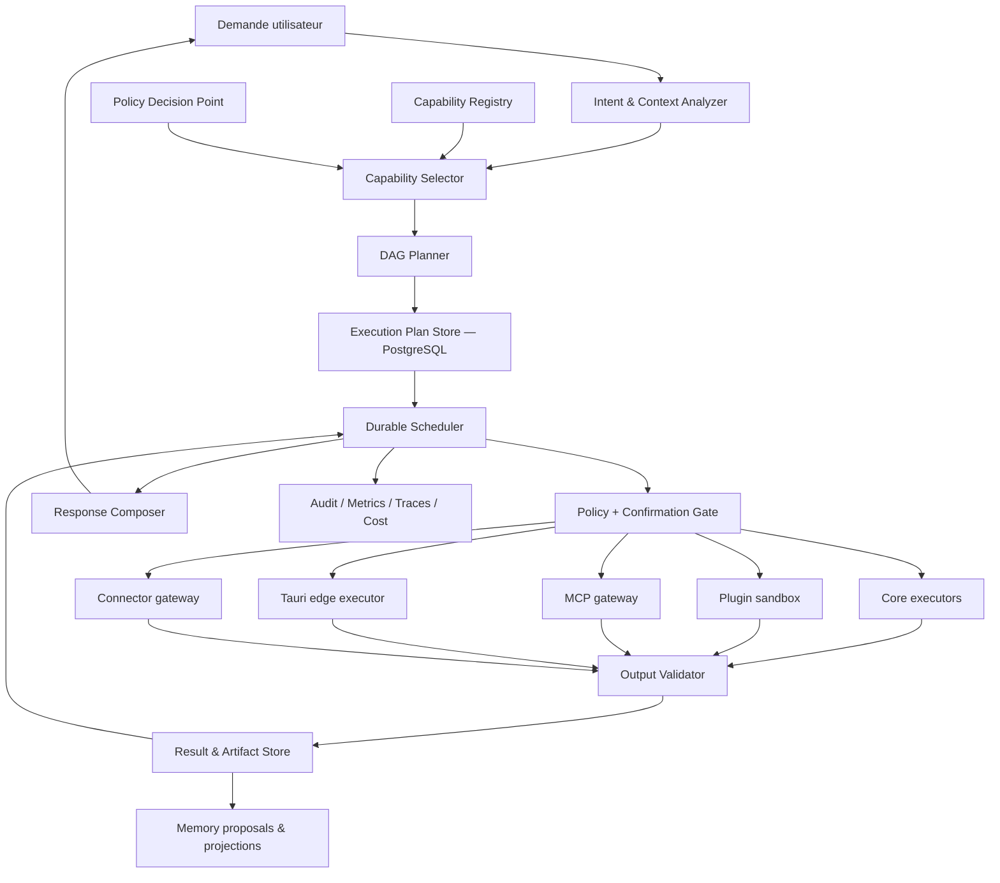
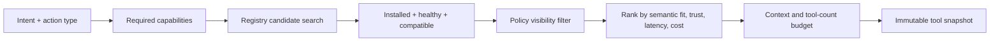
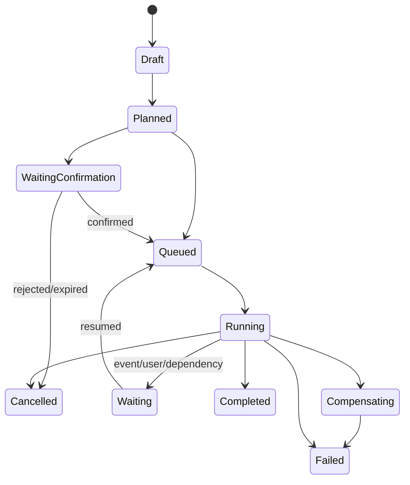
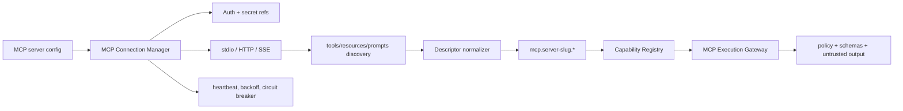

# Architecture cible — ARO Agent OS

## 1. Décisions structurantes

1. **Control plane cloud en monolithe modulaire.** Les frontières sont des modules/crates et des transactions, pas des microservices prématurés.
2. **Workers séparés.** Toute action longue, distante ou reprenable est un job durable. L'API ne conserve pas une requête HTTP ouverte pour orchestrer un plan.
3. **Edge explicite.** Fichiers locaux, shell, modèles locaux, microphone et voix s'exécutent dans Tauri via un agent edge authentifié et à capacités déclarées.
4. **PostgreSQL est la vérité.** Redis sert aux sémaphores, notifications et caches ; Qdrant est une projection ; les fournisseurs externes sont compensables.
5. **Deny by default.** Un tool n'est ni visible ni exécutable sans descriptor valide, installation active, policy decision positive et executor sain.
6. **Le plan est un DAG durable.** Une liste linéaire reste un cas particulier d'un graphe.
7. **Le contenu externe est non fiable.** Web, fichiers, plugins, MCP et mémoire documentaire sont des données, jamais des instructions système.
8. **Compatibilité progressive.** Les IDs et DTO existants restent des alias temporaires derrière une façade `/v1`; aucune migration destructive n'est couplée au premier déploiement de code.

## 2. Vocabulaire canonique

| Concept | Rôle | Peut exécuter du code ? | Peut augmenter les permissions ? |
| --- | --- | --- | --- |
| Tool | Action atomique, typée, observable et idempotente si possible | Oui, via un executor déclaré | Non |
| Skill | Instructions + sélection de tools + workflow + validations pour atteindre un objectif | Non directement ; elle compile un plan | Non, elle ne peut que réduire le plafond |
| Workflow | Graphe versionné de nœuds et dépendances | Par ses nœuds tools/contrôles | Non |
| Plugin | Package signé fournissant descriptors, skills, resources, UI et adapters | Oui, dans un runtime isolé | Non ; installation + grants requis |
| Serveur MCP | Endpoint standardisé fournissant tools/resources/prompts distants | Oui, via l'adapter MCP | Non ; chaque capability reste filtrée |
| Agent | Boucle de décision bornée qui construit ou ajuste un plan | Indirectement | Non |
| Connector | Liaison à un service et à des credentials, réutilisable par tools/plugins | Via un adapter | Non |

## 3. Architecture logique



### Modules cibles

| Module/crate | Responsabilité | Dépend de |
| --- | --- | --- |
| `aro-core` | identités, contextes tenant/actor, erreurs et primitives stables | aucune infrastructure |
| `aro-capabilities` | descriptors tool/skill/workflow/plugin, validation, namespaces | `aro-core` |
| `aro-policy` | RBAC/ABAC, risque, consentement, confirmation, décisions | `aro-core`, `aro-capabilities` |
| `aro-registry` | sources de capabilities, versions, health, snapshot filtré | capabilities, policy ports |
| `aro-execution` | plan DAG, scheduler, budgets, retry, compensation, validation | core, capabilities, policy |
| `aro-search` | query expansion, providers, fusion, citations | capabilities, execution ports |
| `aro-mcp` | discovery/sync/auth/transport/health MCP | capabilities, secrets ports |
| `aro-plugins` | package, signature, runtime, migrations, lifecycle | capabilities, policy, secrets ports |
| `aro-memory` | mémoire versionnée, retrieval, consentement, provenance | core, policy ports |
| `aro-store` | adapters PostgreSQL uniquement | ports des modules |
| `aro-runtime` | gateway modèles et adapters providers | core |
| `apps/api` | transport, auth HTTP, composition | application services |
| `apps/worker` ou mode `worker` | scheduler et executors cloud | application services |
| `apps/desktop/src-tauri` | edge executor et custody locale | contrats générés |

Les nouveaux modules peuvent d'abord être des modules internes aux crates actuelles. Une extraction en crate n'est justifiée que lorsqu'une frontière possède des tests de contrat et au moins deux adapters.

## 4. Contrat canonique d'un tool

### 4.1 Descriptor

Le descriptor est immuable pour une paire `(id, version)`. L'état opérationnel, la santé et les grants sont stockés séparément.

```json
{
  "schemaVersion": 1,
  "id": "core.search.web",
  "version": "1.0.0",
  "name": "Search the web",
  "description": "Search approved public web providers and return cited results.",
  "category": "search",
  "inputSchema": {
    "$schema": "https://json-schema.org/draft/2020-12/schema",
    "type": "object",
    "properties": {
      "queries": { "type": "array", "items": { "type": "string", "minLength": 1 }, "maxItems": 8 },
      "limit": { "type": "integer", "minimum": 1, "maximum": 50 },
      "domains": { "type": "array", "items": { "type": "string" } },
      "freshnessDays": { "type": ["integer", "null"], "minimum": 0 }
    },
    "required": ["queries"],
    "additionalProperties": false
  },
  "outputSchema": {
    "type": "object",
    "properties": {
      "results": { "type": "array" },
      "citations": { "type": "array" },
      "partial": { "type": "boolean" }
    },
    "required": ["results", "citations", "partial"],
    "additionalProperties": false
  },
  "permissions": [
    { "action": "network.read", "resource": "destination:${input.domains}" }
  ],
  "risk": { "level": "low", "effects": ["external-read"], "confirmation": "never" },
  "capabilities": ["search.web", "search.multi-query", "citations"],
  "execution": {
    "kind": "backend",
    "handler": "search.web.v1",
    "environment": "cloud-worker",
    "streaming": true,
    "idempotency": "recommended",
    "sideEffects": "read-only"
  },
  "timeoutMs": 15000,
  "retry": { "maxAttempts": 3, "strategy": "exponential-jitter", "baseDelayMs": 250, "maxDelayMs": 4000 },
  "limits": { "maxConcurrency": 20, "ratePerMinute": 120, "maxInputBytes": 32768, "maxOutputBytes": 1048576 },
  "dependencies": [
    { "kind": "connector", "id": "search-provider", "optional": false }
  ],
  "observability": {
    "recordInput": "metadata-only",
    "recordOutput": "reference-only",
    "costUnit": "request",
    "metricsNamespace": "aro_tool_search_web"
  },
  "status": "active",
  "provenance": { "kind": "core", "package": "aro-search", "signature": null },
  "owner": { "type": "team", "id": "platform-search" },
  "tags": ["web", "read-only"],
  "createdAt": "2026-07-16T00:00:00Z"
}
```

Champs obligatoires : identifiant, version, nom, description, catégorie, schemas d'entrée/sortie, permissions, risque, capabilities, exécution, timeout, retry, limites, dépendances, observabilité, statut, provenance, propriétaire et environnement.

### 4.2 Types d'exécution

| Kind | Runtime | Exemple |
| --- | --- | --- |
| `backend` | worker cloud de confiance | recherche, settings, mémoire |
| `frontend` | commande UI sans accès secret | ouvrir une vue, prévisualiser |
| `edge` | Tauri sur appareil enrôlé | fichiers locaux, shell, voix |
| `plugin-wasm` | Wasmtime/WASI sandbox | transformation déterministe |
| `plugin-remote` | gateway connector | SaaS signé |
| `mcp` | gateway MCP | CRM entreprise |
| `workflow` | expansion en sous-graphe | planifier un voyage |
| `admin` | worker privilégié séparé | rotation, politiques organisation |

Un tool dynamique n'est jamais du code arbitraire injecté dans le process API. Il référence un handler préinstallé, un package signé isolé, un serveur MCP approuvé ou un endpoint distant via gateway.

### 4.3 Requête, contexte et résultat

```json
{
  "invocationId": "uuid",
  "planId": "uuid",
  "nodeId": "uuid",
  "tool": { "id": "core.search.web", "version": "1.0.0", "descriptorHash": "sha256" },
  "tenantId": "uuid",
  "actor": { "type": "user", "id": "uuid" },
  "delegationChain": [],
  "input": {},
  "contextRefs": [],
  "policyDecisionId": "uuid",
  "confirmationId": null,
  "idempotencyKey": "opaque",
  "deadline": "RFC3339",
  "budget": { "cost": 0.05, "tokens": 0, "outputBytes": 1048576 },
  "traceparent": "W3C trace context"
}
```

```json
{
  "invocationId": "uuid",
  "status": "completed",
  "output": {},
  "outputRef": "result://uuid",
  "artifacts": [],
  "citations": [],
  "warnings": [],
  "error": null,
  "attempts": 1,
  "startedAt": "RFC3339",
  "finishedAt": "RFC3339",
  "durationMs": 420,
  "usage": { "inputTokens": 0, "outputTokens": 0, "cost": 0.002, "costCurrency": "USD" },
  "validation": { "schema": "passed", "security": "passed", "provenance": "verified" },
  "executor": { "kind": "backend", "id": "worker-uuid", "region": "eu-west" }
}
```

Les erreurs utilisent un code stable : `invalid_input`, `permission_denied`, `confirmation_required`, `rate_limited`, `timeout`, `dependency_unavailable`, `output_invalid`, `cancelled`, `lease_lost`, `internal`. Le message utilisateur et le diagnostic opérateur sont séparés.

## 5. Namespaces et compatibilité

Format : `<authority>.<provider>.<domain>.<action>`, segments ASCII minuscules, chiffres et tirets.

- `core.search.web`
- `core.user.settings.update`
- `core.user.memory.search`
- `plugin.github.issue.create`
- `mcp.company-crm.customer.read`
- `skill.travel.plan`
- `edge.workspace.file.read`

Les aliases historiques sont temporaires :

| Alias | Canonique |
| --- | --- |
| `web.search` | `core.search.web` |
| `web.fetch` | `core.web.page.read` |
| `workspace.read` | `edge.workspace.file.read` |
| `workspace.write` | `edge.workspace.file.write` |
| `shell.exec` | `edge.workspace.command.execute` |

Un alias n'est jamais exposé au modèle. Il est seulement accepté par l'API de compatibilité et produit une métrique de dépréciation.

## 6. Registre central

Le registre fusionne cinq sources : core, installations plugin, serveurs MCP, skills compilées et exécuteur edge. Il produit un snapshot immuable par plan.

### Pipeline d'enregistrement

1. Parse et validation schema/version/namespace.
2. Vérification provenance, signature et compatibilité.
3. Détection collision `(id, version)` par hash exact.
4. Validation des permissions et du risque par rapport au type d'executor.
5. Résolution des dépendances.
6. Publication en statut `pending`, health-check, puis `active`.
7. Émission `tool.registered` ou rejet audité.

### Sélection



Le ranking est déterministe avant tout reranker modèle : capability exacte, provenance/trust, policy, health, localité/résidence, latence, coût et taux de succès. Un petit reranker peut départager les derniers candidats mais ne peut réintroduire un tool filtré.

Le modèle reçoit normalement 5 à 20 tools, jamais le catalogue complet. Les descriptors complets restent côté orchestrateur ; le modèle reçoit une projection compacte et les schemas nécessaires.

### Révocation

Une révocation marque l'installation/descriptor indisponible, invalide les caches via event, empêche tout nouveau claim et provoque à la prochaine frontière sûre l'annulation des nœuds non commencés. Les exécutions déjà externes sont compensées si le contrat le permet.

## 7. Analyse d'intention et planning

`IntentAnalysis` contient :

- classes `informational`, `action`, `sensitive`, `multi-step` ;
- domaines et capabilities nécessaires ;
- besoin de sources actuelles, mémoire, plugin ou MCP ;
- parallélisabilité ;
- contraintes de coût, temps, résidence et format ;
- données sensibles potentielles ;
- niveau d'incertitude et questions bloquantes.

Le planner applique des règles déterministes aux actions sensibles et utilise le modèle uniquement pour décomposer l'objectif. Le résultat est validé contre les tools réellement visibles, les budgets et les invariants de graphe.

## 8. Plan DAG et orchestration

### 8.1 Nœud

Chaque `execution_node` possède :

- ID, plan ID, kind et tool version/hash ;
- dépendances entrantes/sortantes ;
- mapping d'inputs depuis request/résultats ;
- condition ;
- statut et tentative ;
- timeout et retry policy ;
- idempotency key ;
- policy/confirmation IDs ;
- résultat/error refs ;
- estimation et usage réel temps/coût/tokens ;
- compensation node éventuel ;
- métadonnées de trace ;
- dates ready/leased/started/finished.

Kinds : `tool`, `model`, `map`, `reduce`, `condition`, `approval`, `wait-event`, `subplan`, `compensation`, `finalize`.

### 8.2 Ordonnancement

Le scheduler calcule la frontière de nœuds `ready`, puis réclame avec `FOR UPDATE SKIP LOCKED`. Les sémaphores s'appliquent dans cet ordre : global, organisation, utilisateur, tool, connector/MCP et executor edge.

- **Fan-out** : plusieurs nœuds indépendants deviennent ready dans la même transaction.
- **Fan-in** : un nœud reduce n'est ready qu'après la politique de join (`all`, `all-success`, `quorum`, `first-success`).
- **Retry** : seulement pour erreurs classées retryable et tools idempotents, avec exponential backoff + jitter.
- **Timeout** : deadline du nœud bornée par celle du plan.
- **Annulation** : cooperative token + interdiction de claim ; hard timeout du sandbox si nécessaire.
- **Reprise** : les résultats durables validés ne sont pas rejoués ; les leases expirés redeviennent éligibles.
- **Compensation** : graphe inverse explicite, jamais une supposition du moteur.
- **Fallback** : branche déclarée et policy-validée.
- **Circuit breaker** : état court dans Redis, preuves durables de health en PostgreSQL.
- **Boucles** : uniquement sous forme de sous-plan borné avec compteur, budget et condition validée.
- **Streaming** : événements partiels sans marquer le nœud réussi avant validation finale.

### 8.3 Machine d'état



## 9. Recherche fédérée

`core.search.federated` est un workflow, pas un provider monolithique.

1. Query expansion produit jusqu'à 8 requêtes : précise, large, récente, interne, mémoire et services connectés selon le contexte.
2. Le planner crée des nœuds indépendants pour Web, fichiers, mémoire, plugins/MCP et connecteurs.
3. Chaque provider retourne un `SearchHit` commun : ID, source, title, excerpt, URI, timestamp, ACL, score provider, provenance et citation ref.
4. Le reduce normalise, filtre ACL, déduplique par canonical URI/content hash/entity, puis applique un ranking hybride lexical/vectoriel/récence/trust.
5. Un validateur vérifie accessibilité, fraîcheur et diversité des sources.
6. Le résumé multi-source cite uniquement les `citationRef` validées.

Les API search utilisent cursor pagination et ne chargent jamais toutes les mémoires ou tous les fichiers. Les index sont versionnés et réconciliables.

## 10. Contrat d'une skill

```yaml
apiVersion: aro.dev/skill/v1
kind: Skill
metadata:
  id: skill.travel.plan
  version: 1.0.0
  name: Travel planner
  owner: product-travel
spec:
  objective: Produce an approved itinerary with cited constraints.
  instructionsRef: content://sha256/...
  allowedCapabilities:
    - search.web
    - calendar.read
    - artifact.create
  deniedTools:
    - plugin.travel.booking.purchase
  workflowRef: workflow://skill.travel.plan/1.0.0
  constraints:
    maxSteps: 20
    maxCost: 1.00
    dataResidency: eu
  permissions:
    maximum:
      - network.read
      - calendar.read
  outputSchemaRef: schema://travel-itinerary/1
  successCriteria:
    - all_dates_validated
    - sources_cited
  errorPolicy:
    partialResults: allowed
    onProviderFailure: fallback
  validators:
    - travel.date-consistency.v1
  examplesRef: content://sha256/...
  subskills: []
  dependencies: []
```

Une skill est compilée en `SkillActivation` immuable pour le plan. Elle peut réduire les tools et permissions, jamais les élargir. Instructions, exemples et contenu externe restent séparés du system policy. Installation, activation, compatibilité et version sont auditées.

## 11. Manifeste plugin

```yaml
apiVersion: aro.dev/plugin/v1
kind: Plugin
metadata:
  id: plugin.github
  version: 2.3.0
  publisher: github-inc
  displayName: GitHub
  license: proprietary
spec:
  compatibility:
    aro: ">=0.2.0 <1.0.0"
    protocol: 1
  trust:
    signatureAlgorithm: sigstore
    packageDigest: sha256:...
    transparencyLogEntry: ...
  permissions:
    required:
      - github.repo.read
    optional:
      - github.issue.write
  tools:
    - descriptors/github.issue.create.json
  skills:
    - skills/github.triage.yaml
  resources:
    - schemas/github-issue.json
  ui:
    settingsEntry: ui/settings.wasm
  webhooks:
    - github.issue.updated.v1
  events:
    publishes: [plugin.github.issue.created]
    subscribes: []
  connectors:
    - github-oauth
  settingsSchema: schemas/settings.json
  backgroundJobs:
    - github.sync.v1
  migrations:
    - version: 1
      up: migrations/001.sql
      checksum: sha256:...
  dependencies: []
  runtime:
    kind: wasm
    network: gateway-only
    filesystem: none
    memoryMb: 128
    cpuMillis: 1000
```

Installation : verify → permissions diff → confirmation → staged install → migrations transactionnelles → health-check → activation. Rollback conserve l'ancienne version et utilise des migrations expand/contract. Un plugin SaaS distant expose le même manifeste mais son executor passe par le connector gateway.

## 12. Architecture MCP



- Chaque serveur possède trust level, auth ref, tenant scope, protocol version, capabilities hash et dernière synchronisation.
- Le hash du descriptor distant crée une version interne ; une modification incompatible repasse en `pending-review`.
- Les serveurs non fiables s'exécutent via process sandbox/egress proxy, avec timeout et limites de payload.
- Les resources/prompts MCP ne deviennent jamais automatiquement des instructions système.
- Les conflits sont impossibles grâce au namespace attribué par ARO, indépendamment des noms distants.

## 13. Mémoire

### Types

`conversation`, `short-term`, `long-term`, `preference`, `personal-fact`, `project`, `organization`, `agent`, `action-history`, `conversation-summary`, `document-knowledge`.

### Invariants

- Un souvenir a owner tenant/principal, type, contenu ou content ref, provenance, confiance, sensibilité, ACL, version, TTL et historique.
- Une écriture sensible nécessite une `MemoryProposal` et éventuellement confirmation.
- Les embeddings sont des projections versionnées ; les ACL sont réappliquées au retrieval.
- Fusion et contradiction créent des relations, sans supprimer silencieusement l'historique.
- « Oublier » invalide les projections et planifie la purge, avec reçu d'effacement.

Le modèle de données cible utilise `memories`, `memory_versions`, `memory_sources`, `memory_relations`, `memory_acl`, `memory_consents`, `memory_projection_jobs` et `memory_deletion_receipts`.

## 14. Contexte utilisateur

`UserContextService` expose des vues minimales et finalisées par policy :

- `IdentityContext` : ID opaque, langue, timezone ;
- `AuthorizationContext` : organisation, rôles et capabilities calculées ;
- `PreferenceContext` : uniquement les clés nécessaires ;
- `DeviceContext` : capacités edge, jamais secrets ou chemins bruts ;
- `ConnectedServicesContext` : installations et scopes, pas credentials ;
- `RecentActivityContext` : références bornées ;
- `MemoryContext` : résultats filtrés et provenance.

Les tools publics sont `core.user.profile.read`, `core.user.preferences.read/update`, `core.user.permissions.read`, `core.user.memory.*` et `core.user.settings.*`. Aucune requête modèle n'accède directement à une table utilisateur.

## 15. Paramètres

Scopes : `session`, `device`, `user`, `organization`, `admin`, `global`. La résolution suit une precedence explicite et une allowlist par clé.

Tables : `setting_definitions`, `setting_values`, `setting_versions`, `setting_policy_overrides`. Chaque mutation est un patch typé avec `If-Match`, validation, policy decision et événement `user.settings.updated` sans valeur sensible.

Les tools spécialisés — thème, langue, timezone, notifications, confidentialité, mémoire, intégrations, accessibilité, voix, modèle et autonomie — appellent le même `SettingsService`; ils ne contournent pas son schéma.

## 16. Voix

- STT/TTS local reste le défaut et s'exécute à l'edge.
- `VoiceProvider` normalise streaming, langues, voix, vitesse, tonalité, interruptions, silence et capabilities émotionnelles.
- Les échantillons de voix personnalisée utilisent consentement explicite, proof-of-control, chiffrement, TTL, provenance et suppression vérifiable.
- Les modèles anti-usurpation et règles interdisent l'imitation d'une personne sans autorisation démontrée.
- Les données audio ne sont jamais dans les logs/traces ; les métriques ne contiennent que durée, provider, codes et latence.
- Le fallback entre providers respecte résidence, consentement et confidentialité ; il n'est pas automatique vers un cloud non autorisé.

## 17. Permissions et confirmations

### Risques

| Niveau | Exemples | Confirmation par défaut |
| --- | --- | --- |
| `none` | lecture locale non sensible, thème | aucune |
| `low` | recherche externe, brouillon | aucune si policy autorise |
| `medium` | modification réversible, création externe privée | selon autonomie et contexte |
| `high` | envoi, publication, partage de données, installation plugin | obligatoire ou policy organisation explicite |
| `critical` | suppression irréversible, finance, compte, admin, voix personnalisée | obligatoire, non déléguable |

La décision combine RBAC, ABAC, descriptor, classification des données, destination, contexte, autonomie, quota et consentements. Le frontend ne fait qu'afficher la décision backend.

Une confirmation est liée au hash exact `(tool, version, input canonique, effets, actor, tenant)`, expire, est single-use et ne peut pas confirmer un payload modifié. Le backend revalide permissions et policy juste avant l'effet externe.

## 18. Sécurité

- RLS activé puis forcé pour les données privées, runtime roles `NOBYPASSRLS`.
- Secrets comme références opaques, chiffrement enveloppe KMS et rotation.
- Egress par gateway : DNS pinning, redirect validation, allowlist, proxy explicite, limites et audit.
- Validation JSON Schema entrée/sortie à chaque frontière.
- Sandboxes WASM/process avec CPU/mémoire/fichiers/réseau bornés.
- Prompt injection : séparation instructions/données, étiquetage provenance, suppression des instructions actives issues des sources, policy hors modèle.
- Idempotency obligatoire pour effets externes ; compensation explicite.
- Rate limits et quotas multi-niveaux.
- Export, suppression, retention et consentement RGPD comme workflows durables auditables.
- Supply chain : manifests signés, SBOM, provenance, scans, pinning des digests et revocation.

## 19. Observabilité

Chaque appel enregistre sous forme redacted/reference-only : tenant, actor opaque, plan/node/invocation IDs, intent class, tool/version/hash, source, model, status, latency, retries, error code, cost, tokens, risk, policy decision, confirmation, dependencies et executor.

- logs JSON structurés ;
- traces OpenTelemetry W3C de la requête au provider ;
- métriques RED par tool et USE par worker/executor ;
- dashboards catalogue health, queue/DLQ, coûts, latence, confirmations et sécurité ;
- alertes sur error budget, loops, retry storms, revocations, sandbox violations et dérive de coûts ;
- aucune entrée/sortie brute, secret, token, audio ou contenu mémoire dans logs/traces.

## 20. Modèle de données cible

| Domaine | Tables principales |
| --- | --- |
| Catalogue | `tool_definitions`, `tool_versions`, `tool_aliases`, `tool_dependencies`, `tool_installations`, `tool_health_snapshots` |
| Exécution | `execution_plans`, `execution_nodes`, `execution_edges`, `tool_executions`, `execution_results`, `execution_errors`, `execution_events`, `execution_artifacts` |
| Policy | `permission_definitions`, `role_permission_grants`, `capability_grants`, `policy_decisions`, `confirmations`, `consents`, `delegations` |
| Skills/workflows | `skill_definitions`, `skill_versions`, `skill_installations`, `workflow_definitions`, `workflow_versions` |
| Plugins | `plugin_definitions`, `plugin_versions`, `plugin_installations`, `plugin_resources`, `plugin_migrations`, `plugin_revocations` |
| MCP | `mcp_servers`, `mcp_connections`, `mcp_capability_snapshots`, `mcp_auth_refs`, `mcp_health_history` |
| Mémoire | `memories`, `memory_versions`, `memory_sources`, `memory_relations`, `memory_acl`, `memory_consents`, `memory_projection_jobs` |
| Utilisateur/settings | `setting_definitions`, `setting_values`, `setting_versions`, `user_context_access_events` |
| Voix | `voice_profiles`, `voice_consents`, `voice_sample_refs`, `voice_provider_bindings`, `voice_deletion_receipts` |
| Intégrations | conserver et faire évoluer `connector_definitions`, `integration_installations`, `integration_credential_versions`, `integration_capability_grants`, `integration_jobs` |
| Gouvernance | `audit_events`, `outbox_events`, `quota_policies`, `quota_usage`, `cost_ledger`, `metric_rollups` |

Toutes les tables tenant-scopées portent `organization_id`; les ressources personnelles portent aussi `owner_user_id`. Les contraintes composites empêchent les références cross-tenant. Les états sont contraints, les versions optimistes sont explicites et les événements sont versionnés.

## 21. API cible

Préfixe `/v1` conservé ; write APIs acceptent `Idempotency-Key` et `If-Match` lorsque pertinent.

### Catalogue et exécution

- `GET /v1/tools?capability=&status=&cursor=`
- `GET /v1/tools/{tool_id}/versions/{version}`
- `POST /v1/tool-executions`
- `GET /v1/tool-executions/{invocation_id}`
- `POST /v1/tool-executions/{invocation_id}/cancel`
- `POST /v1/plans`
- `GET /v1/plans/{plan_id}`
- `GET /v1/plans/{plan_id}/events?after=`
- `POST /v1/plans/{plan_id}/cancel|pause|resume`

### Skills, plugins et MCP

- `POST /v1/skills/installations`, `DELETE /v1/skills/installations/{id}`
- `POST /v1/plugins/installations`, `PATCH /v1/plugins/installations/{id}`, `POST .../rollback`
- `POST /v1/mcp/servers`, `POST /v1/mcp/servers/{id}/sync`, `GET .../capabilities`

### Mémoire, contexte et paramètres

- `POST /v1/memory/search`, `POST /v1/memories`, `PATCH /v1/memories/{id}`, `DELETE ...`
- `POST /v1/memories/{id}/merge`, `POST /v1/memory/export`, `POST /v1/memory/forget`
- `GET /v1/user/context?fields=...`
- `GET /v1/settings/{scope}`, `PATCH /v1/settings/{scope}`
- `GET /v1/permissions/effective`, `POST /v1/permissions/revoke`
- `POST /v1/confirmations/{id}/confirm|reject`

## 22. Événements

Enveloppe commune : `eventId`, `eventType`, `eventVersion`, `tenantId`, `actorRef`, `subjectRef`, `correlationId`, `causationId`, `occurredAt`, `payload`, `sensitivity`.

Événements minimum :

- `tool.registered`, `tool.updated`, `tool.revoked`, `tool.started`, `tool.completed`, `tool.failed` ;
- `plan.created`, `plan.started`, `plan.waiting`, `plan.completed`, `plan.failed`, `plan.cancelled` ;
- `confirmation.required`, `confirmation.granted`, `confirmation.rejected`, `confirmation.expired` ;
- `skill.installed`, `skill.updated`, `skill.revoked` ;
- `plugin.installed`, `plugin.updated`, `plugin.rolled_back`, `plugin.revoked` ;
- `mcp.connected`, `mcp.synchronized`, `mcp.disconnected`, `mcp.quarantined` ;
- `memory.proposed`, `memory.created`, `memory.updated`, `memory.merged`, `memory.forgotten` ;
- `user.settings.updated`, `user.permissions.revoked`, `voice.consent.granted`, `voice.data.deleted`.

## 23. Critères de préparation production

1. Aucun P0 ouvert ; RLS et tests cross-tenant actifs.
2. 100 % des tools actifs ont descriptor validé, owner, runbook, SLO et tests de contrat.
3. Aucun tool annoncé au modèle sans executor sain.
4. Reprise prouvée après kill worker, lease expiry et perte Redis.
5. Confirmations exact-hash et revalidation backend testées E2E.
6. Sandbox/egress/prompt-injection testés avec tools et MCP malveillants.
7. Charge et chaos respectent les SLO et quotas multi-tenant.
8. KMS, rotation, SBOM, signatures et provenance vérifiés.
9. Backup/restore, migrations et rollback exercés.
10. Export/suppression/retention RGPD vérifiés avec reçus.
11. Dashboards, alertes, astreinte et runbooks opérationnels.
12. Déploiement canary sans dérive de taux d'erreur, latence ou coût.
