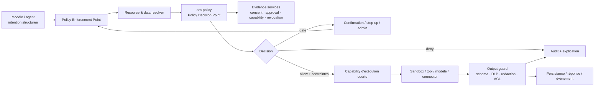

# Architecture cible de gouvernance IA

## Principes non négociables

1. Deny by default et moindre privilège.
2. Le modèle produit une intention, jamais une autorité.
3. Toute identité, ressource, classification et preuve est résolue côté serveur.
4. Une permission utilisateur ne peut pas contourner une restriction organisationnelle ou globale.
5. Une délégation est une atténuation : `droits_enfant ⊆ droits_parent`.
6. Une décision précède chaque effet et un output guard précède toute persistance/transmission.
7. La révocation live peut réduire un snapshot ; elle ne peut jamais l’élargir.
8. Les pages, fichiers, emails, sorties plugin/MCP et mémoires sont des données non fiables.
9. Les décisions sont explicables et auditables sans journaliser de secret ou contenu brut.
10. Les policies publiées sont immuables ; toute évolution crée une nouvelle version.

## Vue d’ensemble

## Plans de contrôle et de données

### Control plane

- Catalogue de permissions et rôles.
- Policy sets et versions publiées.
- Restrictions globales/organisationnelles.
- Manifests de tools/plugins/skills/MCP.
- Classification et data handling policies.
- Consents, approvals, grants, capabilities et revocations.
- Simulation, explication, inventaire effectif et audit.

### Data plane

- PEP HTTP pour chaque endpoint sensible.
- PEP worker avant claim, plan, modèle, tool, commit et délégation.
- PEP desktop local utilisant les mêmes contrats et une policy bundle signé/cache local.
- PEP connecteur avant usage d’un credential ou effet externe.
- Output guards après tool/modèle/plugin/MCP et avant stockage, partage ou affichage.

## Modèle de décision

### Requête canonique

`AuthorizationRequest` contient :

- `id` et `intentDigest` calculé sur la représentation canonique complète ;
- sujet effectif, acteur humain, parent éventuel et attributs fiables ;
- action normalisée (`files.read`, `email.send`, `tool.execute`, etc.) ;
- ressource, owner, tenant, classification, relations et attributs résolus ;
- workspace, conversation, agent, run, task et environnement ;
- tool/plugin/skill/MCP, modèle et fournisseur ;
- risque, montant, coût, budget et compteurs déjà consommés ;
- device, IP, origine et durée ;
- scopes demandés ;
- preuves rechargées côté serveur.

Le payload modèle/client ne peut fournir directement ni tenant, ni owner, ni classification, ni
preuve « validée ». Il fournit seulement des références et paramètres d’intention.

### Décision canonique

- `allow`
- `deny`
- `allow_with_constraints`
- `require_confirmation`
- `require_step_up_authentication`
- `require_admin_approval`

La réponse inclut raison, policies appliquées, contraintes, scopes, expiration, délégation,
redactions, audit, confirmation exacte et code stable.

### Ordre de résolution

1. Invariants de sécurité : identité complète, tenant identique, request non expirée, secret sans
   transfert externe.
2. Révocations effectives et policy epoch.
3. Deny global ou organisationnel.
4. Deny user/resource/component.
5. Présence d’au moins un allow actif.
6. Gates admin, step-up et confirmation.
7. Intersection de toutes les contraintes ; une intersection disjointe est un deny.
8. Validation des ressources/scopes/tools/env/models/providers, lecture seule, montant, appels et
   budget.
9. Émission d’une décision et, si nécessaire, d’une capability d’exécution courte.

Un deny explicite domine toujours un allow. Les listes vides sur le wire signifient « non borné par
cette règle », mais le moteur conserve l’état interne d’intersection vide et refuse ; il ne le
reconvertit jamais en accès illimité.

## Combinaison RBAC, ABAC, ReBAC et capabilities

- **RBAC** : administration simple, rôles historiques, rôles custom et permissions stables.
- **ABAC** : classification, environnement, risque, provider, heure, device, quota, budget,
  finalité et attributs de sujet/ressource.
- **ReBAC** : owner, membre d’équipe, assigned-to-project, audience explicite, parent/enfant et
  partage.
- **Resource ACL** : exceptions explicites sur ressource, audience, action, expiry et grantor.
- **Consent** : choix humain compréhensible, révocable et limité par finalité.
- **Temporary grant** : autorité serveur bornée à une session/run/task/durée/compteur.
- **Capability** : bearer opaque signé/hashé, single-use si nécessaire, lié à l’intention exacte.

Les rôles fournissent des allow généraux ; ABAC/ReBAC et restrictions les réduisent. Une capability
ne peut jamais dépasser la décision et le grant ayant servi à l’émettre.

## Classification et traitement des données

Ordre : `public < internal < personal < confidential < sensitive < highly-sensitive < secret`,
avec `regulated` comme catégorie imposant la policy dédiée la plus restrictive.

Chaque ressource peut définir une classification globale et des overrides par champ. Le resolver
calcule la classification maximale des inputs réellement transmis. La data handling policy détermine :

- modèles/providers/environnements autorisés ;
- transfert externe, export et partage ;
- encryption, redaction et champs interdits ;
- niveau de confirmation ;
- durée de rétention et possibilité d’audit du contenu ;
- output guard à appliquer.

Une donnée `secret` n’est jamais envoyée à un provider externe. Les données sensibles ne le sont que
si la restriction globale, l’organisation, le consentement et la policy provider l’autorisent tous.

## Consentement

Un consentement référence l’utilisateur, l’agent, l’action, le sélecteur de ressources, le service,
la finalité, le partage, la réversibilité, le scope temporel et l’expiration.

Portées : once, session, conversation, agent, organization, fixed-duration, until-revoked.

Le consentement n’est pas un allow autonome : il satisfait une condition d’une policy. La
révocation incrémente l’epoch, invalide le cache, les grants/capabilities dérivés et les runs en
attente concernés.

## Confirmation, step-up et approbation

- La demande stocke un `bindingHash` de l’intention canonique.
- La preuve est liée au sujet, agent, action, ressource, montant, device si nécessaire, durée et
  `intentDigest`.
- Une preuve one-shot est consommée atomiquement avec `EffectPrepared`.
- Une modification de paramètres produit un autre digest et invalide la preuve.
- Le step-up est une preuve de session courte, liée au sujet/device et révocable, jamais un booléen
  fourni par le client.
- Une approbation admin doit être chargée côté serveur, non révoquée, non expirée, liée au digest et
  décidée par un principal ayant encore le droit d’approuver.

## Agents et délégation

Chaque run fige : agent, owner, tenant, profil/policy version, outils et modèles autorisés, plafond de
permissions, budgets, quotas, environnement et policy epoch.

Avant chaque effet, la policy live est réévaluée. Le résultat effectif est :

`snapshot_maximum ∩ live_policy ∩ grant/capability ∩ resource_policy`.

Création d’un sous-agent : objectif, actions, tools, ressources, scopes, environnement, durée,
budget, appels et délégabilité. `attenuate_delegation` impose les sous-ensembles et les limites
monotones. La DB impose tenant et parentage composites. La révocation du parent cascade vers tous
les descendants et leurs capabilities.

Profondeur et nombre de sous-agents sont des restrictions organisationnelles. `agent.delegate`
reste désactivé tant que le workflow durable, la cascade et les tests E2E ne sont pas actifs.

## Tools, plugins, skills et MCP

### Manifest commun

Chaque composant publie : version/hash/signature, owner/trust, actions/resources, données consommées
et produites, permissions, risque, effets, réversibilité, egress, filesystem, secrets, environnement,
limites, confirmation, schemas input/output et observabilité.

### Gateway d’exécution

1. Résoudre le descriptor exact et vérifier hash/signature/status.
2. Valider l’input contre JSON Schema et canonicaliser l’intention.
3. Résoudre ressources, owners et classifications.
4. Évaluer et auditer la policy.
5. Charger/consommer approval/capability en transaction.
6. Réserver budget/quota et enregistrer `EffectPrepared` avec idempotency key.
7. Exécuter dans l’environnement autorisé avec network/filesystem/secrets minimaux.
8. Valider output schema, provenance, DLP, redaction et taille.
9. Committer résultat/usage/audit ou compenser.

Une skill ne peut que réduire la liste de tools. Un plugin/MCP est non fiable, isolé, sans accès aux
secrets hors capability, et ses sorties ne deviennent jamais des instructions système.

## Contexte utilisateur contrôlé

Le modèle n’obtient pas l’objet utilisateur complet. Il invoque des intents typés :

- `user.profile.read`
- `user.preferences.read/update`
- `user.memory.search/create/update/delete`
- `user.settings.update`
- `user.permissions.inspect`

Le resolver applique la classification par champ, la finalité, les redactions et la politique de
transfert avant de construire un context pack minimal. Chaque source conserve provenance,
classification et ACL ; le texte externe est délimité comme donnée non fiable.

## Modèle de données

La migration fondation introduit :

| Agrégat | Tables principales | Invariants |
| --- | --- | --- |
| RBAC | `authorization_roles`, `authorization_permissions`, `authorization_role_permissions` | rôles tenant, permission catalog stable |
| Policies | `policy_sets`, `policy_versions`, `policy_rules` | versions publiées/règles immuables, source hash |
| Affectation | `permission_assignments` | un seul target par assignment, expiry/revocation |
| Ressources | `governed_resources`, `resource_classifications` | FK tenant composite, classification temporelle |
| Agents/components | `agent_permission_bindings`, `component_permission_manifests` | owner/profile tenant, manifest version/hash/trust |
| Human-in-loop | `user_consents`, `approval_requests` | finalité, scope, binding hash, expiration/consommation |
| Autorité courte | `temporary_grants`, `authorization_capabilities` | token hash/nonce, max uses, expiry, revoke |
| Délégation | `permission_delegations` | parent tenant composite, profondeur/budget/expiry |
| Révocation | `permission_revocations` | cible polymorphe, cascade, effective_at |
| Organisation/data | `organization_restrictions`, `data_handling_policies` | verrou admin, provider/model/env/redaction/rétention |
| Preuve | `permission_evaluations`, `security_audit_events` | snapshots metadata-only, séquence tenant, hash chain |

Toutes les tables tenant sont RLS dès leur création, avec contexte transactionnel serveur. Les
index couvrent sujet, ressource, décision, expiration, statut et lookup de révocation. Les tokens
bruts ne sont jamais stockés.

## Contrats API

### Décision et explication

- `POST /v1/permissions/check` — décision du sujet courant sur ressource résolue.
- `POST /v1/policies/simulate` — admin, sans effet, policy version explicite.
- `GET /v1/permissions/effective` — droits effectifs bornés et provenance.
- `GET /v1/permissions/evaluations/{id}` — preuve expurgée et explication.
- `POST /v1/permissions/explain` — raison, règle bloquante, remédiation autorisée.

### Administration

- `POST /v1/policies`, `POST /versions`, `POST /publish`.
- `POST /v1/permissions/grants`, `DELETE /grants/{id}`.
- `POST /v1/permissions/requests`, `POST /approve`, `POST /deny`.
- `POST /v1/consents`, `DELETE /consents/{id}`.
- `POST /v1/capabilities` et `DELETE /v1/capabilities/{id}`.
- `POST /v1/revocations`.
- `GET /v1/agents/{id}/permissions`, `/tools/{id}/permissions`, `/audit/security`.

Le serveur ignore les champs d’identité/tenant/owner/classification non autorisés et les résout à
partir du principal et des repositories. Toutes les mutations admin exigent PDP, idempotence, audit
atomique et souvent step-up.

## Matrice minimale de permissions

| Sujet | Action | Ressource | Décision par défaut | Gate |
| --- | --- | --- | --- | --- |
| user | profile/preferences read | propres champs non sensibles | allow contraint | audit standard |
| user/agent | memory search | mémoire propre + consent | allow contraint | local model si sensible |
| agent | file read | roots/projet assigné | allow contraint | classification/output guard |
| agent | file write | workspace autorisé | confirmation selon risque | idempotence/backup |
| agent | email draft | compte/scopes autorisés | allow contraint | aucune émission |
| agent | email send | message exact | require confirmation | digest + one-shot |
| agent | delete/publish/payment | ressource exacte | strong/admin selon policy | step-up + capability |
| sub-agent | toute action | sous-ensemble du parent | deny sans delegation grant | expiry/cascade |
| plugin/MCP | tool execute | manifest + installation + scopes | deny par défaut | sandbox/trust |
| org admin | permission modify | sujet/ressource tenant | step-up/admin workflow | audit immutable |
| tout sujet | secret vers externe | secret | deny invariant | aucune remédiation user |

## Cache, performance et révocation

- Policy bundle compilé par `(organization_id, policy_epoch, subject_epoch, version_hash)`.
- Cache local L1 et Redis L2, TTL court, jamais clé seulement par rôle.
- Pub/sub d’invalidation + outbox transactionnelle après publication/révocation.
- Bloom/index de révocations pour lookup rapide, vérification DB sur actions élevées/critiques.
- Batch evaluation pour context building et listes UI.
- Capability courte pour le data plane, mais réévaluation live avant effets irréversibles.
- En panne du PDP/cache : lecture publique éventuellement dégradée selon policy ; toute mutation ou
  donnée sensible échoue fermée.

## Audit et observabilité

Audit sécurité séparé des logs techniques. Il enregistre IDs, sujet/acteur/agent/run/tool,
action/ressource/classification, policy versions, décision/contraintes, evidence IDs, résultat,
durée, epoch et hash — jamais secret, prompt ou output brut.

La séquence est monotone par tenant sous advisory lock et unique en DB ; `previous_hash` et
`event_hash` détectent la modification/fork. L’archivage utilise une identité de maintenance
séparée et un ancrage externe périodique. Métriques : latence PDP, deny/gates, cache hit, stale epoch,
divergences shadow, révocations, approvals expirées et violations output guard.

## Critères production

- 100 % des points d’effet inventoriés passent par un PEP testé.
- Aucun tool/model/plugin/MCP n’accepte une autorité construite par le modèle/client.
- RLS active/forcée sur toutes les données privées avec rôle non-owner.
- Zéro divergence inexpliquée en shadow sur la fenêtre convenue.
- Révocation propagée sous le SLO et testée pendant un run.
- Matrice négative multi-tenant/roles/agents/components verte.
- Confirmation one-shot, idempotence, budget et output guards testés en concurrence.
- Audit expurgé, append-only, exportable, rétentionné et vérifiable.
- Runbooks rollback, incident, clé/epoch, cache/PDP et restauration validés.

