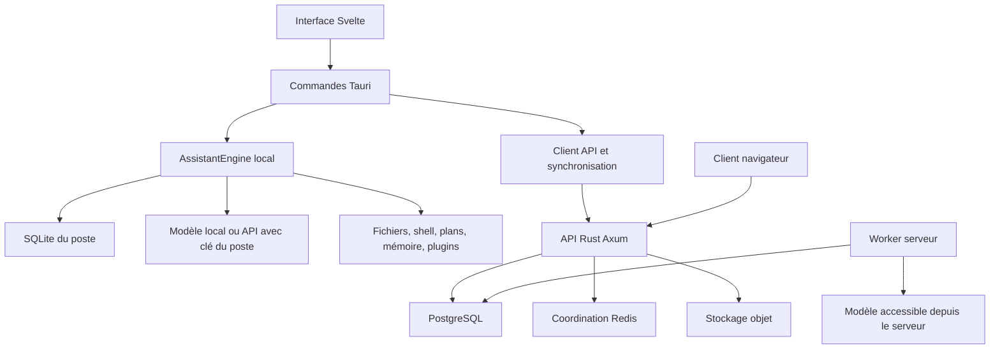

# ARO — analyse du produit et de son implémentation

Analyse commencée le 6 septembre 2026, reprise sur le code modifié le même jour. Ce document examine l'architecture, les parcours exécutables, la persistance, les agents, les intégrations, les tests et les conséquences commerciales. Il ne constitue pas un audit de sécurité exhaustif ni une certification de production.

## Conclusion

**ARO est un espace de travail IA desktop hybride : conversations, projets locaux, outils de développement, plans, mémoire, voix, modèles interchangeables et services cloud.** Le réduire à une application de dictée ou à une interface de chat serait inexact.

Son principal actif est l'intégration de ces fonctions dans une application de travail. Son principal risque est la différence entre une capacité affichée, son implémentation locale et son équivalent serveur. La création d'un agent, l'exécution d'une tâche et son exécution durable sont notamment trois choses différentes dans le code actuel.

L'état observé correspond à une **alpha technique avancée dont plusieurs parcours doivent être consolidés**, pas à un service public dont les garanties sont déjà démontrées. Ce jugement porte sur les chemins examinés et les vérifications listées ici, sans pourcentage artificiel de complétude.

## Périmètre et traçabilité

- Workspace Rust : 18 packages, dont l'API Axum, le desktop Tauri et 16 bibliothèques.
- Frontend Svelte/TypeScript ; SQLite sur le poste ; PostgreSQL côté serveur ; Redis ; stockage objet ; Qdrant optionnel pour la mémoire vectorielle.
- Inventaire archivé : 398 fichiers texte sélectionnés, environ 5,7 Mo. Inventorier un fichier n'équivaut pas à l'auditer ligne par ligne.
- Les recherches ont été suivies de lectures des fonctions qui relient UI, IPC, runtime, fournisseurs, stockage et workers. Les documents de juillet ont été traités comme des intentions ou des états historiques, pas comme l'autorité sur le code actuel.
- Le code a évolué entre les premières lectures et la reprise. Deux copies et leurs empreintes SHA-256 sont conservées sous `output/analysis-2026-09-06/`. Les constats ci-dessous tiennent compte des correctifs observés lors de la reprise.
- Aucun correctif applicatif, commit, déploiement ou achat n'a été réalisé pour cette analyse. Les ajouts propres à l'analyse sont ce rapport, les journaux, les copies de sources et les sondes dans `output/analysis-2026-09-06/`.

À la vérification finale, deux fichiers applicatifs avaient encore changé depuis l'instantané : `McpSettings.svelte` (masquage des variables d'environnement) et `aro-tools/src/lib.rs` (extension du filtre de commandes et nouveaux tests). Ces différences ont été lues, mais les totaux de tests rapportés ne certifient pas ces ajouts postérieurs. Les constats s'appuient sur les sources archivées et les contre-vérifications explicitement décrites, pas sur une prétention de validation atomique d'un workspace modifié en parallèle. L'empreinte de la fonction de patch testée correspond toujours à la fonction actuelle lors du contrôle final.

[Manifeste des sources examinées](C:/Users/Stagiaire/Documents/ARO/output/analysis-2026-09-06/reviewed-manifest.json)

## 1. Ce qu'est réellement le produit

ARO réunit trois usages :

1. **Assistant personnel** : écrire, réfléchir, résumer, parler à l'IA, retrouver des souvenirs.
2. **Espace de travail de production** : organiser projets et dossiers, consulter des fichiers, produire du code ou des documents, lire/appliquer des différences, suivre des plans.
3. **Plateforme d'agents** : modèles interchangeables, catalogue d'outils, skills, plugins, MCP, files d'exécution, permissions et intégrations.

Le code récent investit fortement les deux derniers usages. L'ancienne proposition « assistant vocal privé » explique une partie du projet, mais ne décrit plus son périmètre actuel.

La promesse la plus cohérente à tester commercialement serait : **« Un espace de travail IA sur ton ordinateur, qui conserve le contexte de tes projets et t'aide à produire, examiner et appliquer des résultats. »** La voix est alors une façon d'interagir. La mémoire et les projets donnent la continuité. Les modèles sont des moteurs remplaçables. Les outils permettent l'action.

Il s'agit d'une proposition de positionnement issue du code, pas d'une preuve de demande du marché.

## 2. Les trois chemins techniques

### Desktop

Le parcours `submitMessage → sendMessageStream → message_send_stream → AssistantEngine::send_message_stream` passe par Rust sur le poste. Le moteur enregistre messages et étapes dans SQLite, construit le contexte, consulte le fournisseur, interprète les actions et exécute les outils. Les événements alimentent le chat et les étapes visibles.

Les adaptateurs modèles comprennent Ollama, llama.cpp, OpenAI, Anthropic, Google, Mistral et les endpoints compatibles. Leur présence ne prouve pas la compatibilité réelle de chaque nom de modèle proposé : les essais externes avec clés et modèles réels n'ont pas été réalisés ici.

### Synchronisation

Après génération locale, Tauri tente d'envoyer conversation, message utilisateur et réponse au serveur. PostgreSQL conserve aussi organisations, membres, configurations, fichiers, événements et intégrations. Dans la version récente, un échec de `persist_local_result` est journalisé mais n'empêche pas de retourner la réponse locale ; aucune file desktop de rejeu n'a été identifiée dans ce chemin.

La synchronisation observée est donc une série d'opérations locales et distantes, avec des replis, plutôt qu'un protocole unique dont convergence, conflits et reprise seraient démontrés. La présence d'un outbox serveur ne prouve pas qu'un message desktop ayant échoué à l'envoi sera rejoué.

### Serveur et navigateur

Le navigateur utilise des requêtes HTTP vers l'API. Ce chemin n'a pas les mêmes accès au disque, au trousseau et aux moteurs locaux que Tauri. Le handler assistant serveur attend la génération avant de découper le texte en événements SSE : l'endpoint porte le nom de stream, mais ne transmet pas les premiers tokens pendant le calcul sur ce parcours.

Le worker d'agents est encore un autre chemin. Une référence à Ollama côté serveur désigne le serveur, pas automatiquement le PC du client. Les clés gardées dans le trousseau du poste ne deviennent pas disponibles au worker.

**Conséquence : fermer le desktop ne déplace pas son exécution locale dans le cloud.** Une exécution persistante sur le poste ou un environnement distant doit être conçu explicitement.

## 3. Matrice des capacités

| Capacité | Implémentation observée | Limite à retenir |
|---|---|---|
| Chat avec plusieurs fournisseurs | Adaptateurs et sélection de modèle réels | Essais avec fournisseurs réels non réalisés |
| Voix | Capture, Whisper/Piper, validation WAV et délais de processus | Qualité micro, modèles et machines clientes non mesurée ici |
| Projets, dossiers et chemins locaux | Stockage, navigation et résolution de racine présents | Séparation du chemin local et de l'état synchronisé à clarifier |
| Mentions `@` de fichiers | Autocomplétion, résolution et injection de contenu dans le message présentes dans la version reprise | Lecture plafonnée ; validation desktop réelle restant à faire |
| Lecture/écriture et shell | Outils exécutables ; protection de racine récemment renforcée | Une racine fournie n'est pas une politique d'autorisation complète |
| Visual Diff et artefacts | UI et commandes d'écriture sur disque reliées | Un patch périmé peut écraser une modification sans conflit |
| Plans | CRUD local et outils de plans reliés | Une checklist n'est pas une preuve de reprise automatique |
| Boucle d'agent du chat | Modèle → action → outil → contexte → modèle | Budgets et interruption du travail en cours incomplets |
| Sous-agents locaux | Création de run, contexte, statut et affichage | Le chemin de délégation examiné ne lance pas de worker de génération |
| Agents serveur | Soumission, leases et worker présents | Worker à une génération ; pas l'équivalent de la boucle locale |
| Mémoire | SQLite, recherche et service vectoriel optionnel | Cloisonnement local par compte/organisation non visible |
| MCP et plugins | Installation, discovery, clients HTTP/stdio et dispatch | Certains replis annoncent un succès sans opération correspondante |
| Connecteurs | Infrastructure OAuth et installations côté serveur | Le dispatcher local générique retourne encore une liste vide / indisponibilité |
| Scheduler et hooks | Écrans, tables et CRUD | Exécuteur général des tâches planifiées/hooks non identifié dans le worker examiné |
| Équipes | Organisations, memberships, invitations et politiques serveur | Cela ne suffit pas à garantir le cloisonnement de tout le desktop |
| Facturation | Pas de parcours de vente ARO identifié | Checkout, droits, quotas et comptabilité d'usage à construire |

Les mentions `@` de fichiers ont progressé depuis la première lecture : `mention-model`, le popover du composer, `buildMentionContext` et son appel lors de la soumission sont présents dans la version reprise. Ce point illustre pourquoi l'état historique de PROJECT.md ne suffit pas à classer une fonctionnalité comme absente ou livrée.

## 4. Constats qui changent la décision de lancement

### A. L'application locale n'isole pas visiblement son stockage par identité cloud

`AppState` ouvre un fichier `aro.sqlite3` sous le répertoire applicatif du compte système. La création de l'engine n'utilise ni utilisateur cloud ni organisation. Au bootstrap, les conversations locales sont chargées puis fusionnées avec celles du cloud. La déconnexion et le changement d'organisation changent la session, sans basculer l'engine vers une autre base.

Le risque concerne **deux comptes ARO ou deux organisations utilisés dans la même installation et sous le même compte système** : affichage ou rappel de contenu appartenant au contexte précédent. Cela n'établit pas un accès entre clients distants via PostgreSQL.

À faire : choisir un cloisonnement de la base/cache, l'appliquer aux conversations, souvenirs et index vectoriels, puis tester A → déconnexion → B et organisation 1 → organisation 2. Priorité avant de promettre un usage en équipe.

Références : [state.rs](C:/Users/Stagiaire/Documents/ARO/apps/desktop/src-tauri/src/state.rs:235), [bootstrap desktop](C:/Users/Stagiaire/Documents/ARO/apps/desktop/src-tauri/src/main.rs:190).

### B. « MFA configuré » ne signifie pas encore « MFA imposé à la connexion »

La version récente vérifie un vrai code TOTP lors de l'activation et de certaines opérations MFA. C'est une amélioration par rapport à la première lecture. Mais `auth_login` vérifie le mot de passe puis appelle `issue_session`, sans challenge TOTP dans le chemin examiné.

À faire : parcours de connexion en deux étapes, preuve du second facteur avant émission de la session complète, récupération et tests négatifs. Ne pas vendre actuellement ce parcours comme une authentification forte démontrée.

Référence : [auth_login](C:/Users/Stagiaire/Documents/ARO/apps/api/src/handlers.rs:249).

### C. La récupération de mot de passe n'est pas un parcours utilisateur complet

`auth_password_reset_request` génère un jeton, conserve son hash et journalise la génération. Aucun envoi ni mise en file du jeton vers l'utilisateur n'apparaît dans cette fonction. La réponse HTTP de succès ne suffit donc pas à permettre la récupération.

À faire : livraison du lien, confirmation atomique, comportement de révocation des sessions et test de bout en bout. Le worker d'invitations existant ne prouve pas la livraison des resets.

Référence : [demande de réinitialisation](C:/Users/Stagiaire/Documents/ARO/apps/api/src/handlers.rs:280).

### D. Appliquer un patch ne vérifie pas que le fichier correspond à la version attendue

La fonction `apply_unified_patch` supprime les lignes par position, sans comparer le contenu retiré au contenu attendu. Une sonde a extrait cette fonction sans la modifier et l'a exécutée sur des chaînes en mémoire : un patch référençant `old_expected_line` a remplacé `user_modified_line` et renvoyé un succès. Le contrôle avec la bonne version du fichier passe également.

À faire : refus explicite du conflit, empreinte de la version de départ, écriture atomique et possibilité de restauration. C'est une condition importante pour un produit qui modifie le code de ses utilisateurs.

Références : [fonction de patch](C:/Users/Stagiaire/Documents/ARO/apps/desktop/src-tauri/src/main.rs:2195), [résultat reproductible](C:/Users/Stagiaire/Documents/ARO/output/analysis-2026-09-06/patch-probe.log), [provenance](C:/Users/Stagiaire/Documents/ARO/output/analysis-2026-09-06/patch-probe-provenance.json).

### E. Les sous-agents affichés ne prouvent pas une exécution parallèle

Le handler local `agent.delegate` / `agent.spawn` appelle `start_agent_run`. Cette fonction crée le run, le planifie en termes de statuts, conserve les étapes initiales et son contexte, puis retourne une vue. Elle ne lance pas de boucle de génération. Faire passer un run à `Running` dans la base ne démarre pas son travail.

À faire : dispatcher réel, exécution observable, état final, supervision et reprise. Tester deux sous-agents jusqu'à la production de deux résultats réels, pas seulement deux lignes dans l'interface.

Références : [démarrage local](C:/Users/Stagiaire/Documents/ARO/crates/aro-runtime/src/lib.rs:420), [délégation locale](C:/Users/Stagiaire/Documents/ARO/crates/aro-runtime/src/lib.rs:1731).

### F. Le worker serveur reste différent du moteur d'agent desktop

Il réclame des jobs et renouvelle leurs leases, mais le corps exécuté effectue une génération de texte avec un historique vide, puis complète le job. Il n'appelle pas la boucle générale d'outils du desktop. Le `None` passé au routeur comme clé empêche l'utilisation des fournisseurs exigeant une clé sur ce chemin.

La version récente marque explicitement certains échecs de modèle, ce qui corrige un ancien faux succès. Les limites restantes concernent l'exécution multi-étapes, les secrets serveur, le contexte complet, les effets externes et l'interruption du travail déjà engagé.

À faire : définir les environnements d'exécution, réutiliser un même contrat d'actions et de checkpoints, puis prouver pause, annulation, panne et reprise. `aro-agent-domain` existe et possède des tests, mais aucune dépendance applicative à cette bibliothèque n'a été identifiée : elle ne remplace pas encore les moteurs en service.

Référence : [worker d'agents](C:/Users/Stagiaire/Documents/ARO/apps/api/src/agent_runner.rs).

### G. Les garanties d'exécution doivent être appliquées à tous les chemins

La sonde récente confirme le refus de `../outside-declared-root.txt` lorsqu'une racine est fournie. Ce contrôle ne démontre pas le confinement général du shell, d'un plugin ou d'une racine choisie par le modèle. Le runtime ajoute `root_path` seulement si l'action n'en contient pas déjà ; la validation d'action vérifie surtout le nom de l'outil et la forme de l'entrée.

La boucle du chat ignore `requested_max_steps`. Aucun contrôle général de temps/coût ni vérification de l'annulation du run entre chaque tour n'a été identifié dans cette boucle. La version récente du shell possède un timeout et `kill_on_drop` : ces protections par processus sont utiles, mais ne démontrent pas l'annulation globale d'une tâche ni l'autorisation de chaque action. Le garde contre les doubles envois du desktop est également distinct d'une supervision de l'exécution.

À faire : autorité de racine déterminée par l'application, décisions de permission exécutoires, annulation propagée aux processus, limites de ressources et essais spécifiques. Une liste d'outils marqués dangereux ou un formulaire de permissions ne suffit pas.

Références : [boucle locale](C:/Users/Stagiaire/Documents/ARO/crates/aro-runtime/src/lib.rs:716), [dispatch](C:/Users/Stagiaire/Documents/ARO/crates/aro-runtime/src/lib.rs:894), [sonde de comportement](C:/Users/Stagiaire/Documents/ARO/output/analysis-2026-09-06/behavior-probe.log).

### H. Certains statuts de plugins peuvent donner une impression trompeuse de réussite

Le client MCP possède des transports réels. Toutefois, quand la connexion échoue, le gestionnaire peut basculer vers un exécuteur natif. Sa branche générique renvoie un texte « Executed native tool ... » avec `is_error: false`, sans réaliser d'opération spécifique. Ce n'est pas une preuve que le serveur MCP demandé a exécuté l'outil.

À faire : distinguer transport distant, adaptateur natif explicitement choisi et indisponibilité. Les outils inconnus doivent échouer. Tester les plugins installés avec des effets observables et des serveurs absents.

Référence : [gestionnaire de plugins](C:/Users/Stagiaire/Documents/ARO/crates/aro-plugins/src/manager.rs).

### I. L'usage affiché ne peut pas encore servir directement de facturation

Dans la boucle locale, `token_estimate` est remplacé à chaque génération. Le worker renseigne la même estimation en entrée et en sortie, avec une étape et zéro appel d'outil. Ces informations peuvent servir au diagnostic, mais ne forment pas un registre fiable de consommation facturable.

À faire avant les crédits : mesurer chaque appel, distinguer tokens entrants/sortants/cache, enregistrer modèle et prix applicables, réserver un budget, régler le coût réel, dédupliquer et traiter les échecs. Aucun checkout ou système d'entitlements ARO n'a été trouvé dans le périmètre backend examiné.

### J. Les migrations n'activent pas encore RLS sur les données privées principales

Après application des 42 migrations sur une base PostgreSQL neuve, une interrogation de `pg_tables` et `pg_policies` montre deux politiques présentes pour chacune des tables `conversations`, `messages` et `memories`, mais `rowsecurity = false`. Les tables `plans`, `projects`, `folders` et `agent_run_jobs` examinées sont également sans RLS activé.

La migration `202607020011_private_data_rls_policies.sql` documente explicitement cette activation différée. Ce résultat est donc cohérent avec le SQL, et ce n'est pas une preuve que les routes API exposent actuellement les données entre clients : leurs contrôles et filtres existent. En revanche, on ne peut pas compter sur la base pour bloquer une future requête applicative mal cloisonnée sur ces tables.

Le contrôle de démarrage `row_security = on` de la connexion n'active pas à lui seul RLS sur une table. De même, le test `rls_placeholder_test` ne démontre pas la propriété annoncée par le nom de l'étape CI.

À faire : finir le basculement des requêtes, revoir les tables récentes et leurs grants, activer les politiques explicitement, puis prouver les refus inter-organisations avec un compte SQL non propriétaire. Éviter une simple activation non testée qui casserait des parcours existants.

Référence : [preuve SQL sur base isolée](C:/Users/Stagiaire/Documents/ARO/output/analysis-2026-09-06/postgres-schema-evidence.log).

## 5. Qualités techniques à conserver

- Le découpage en bibliothèques sépare déjà fournisseurs, voix, mémoire, fichiers, intégrations, politiques et domaine d'agents.
- Des protections serveur concrètes existent : rotation des refresh tokens, trousseau système desktop, identités PostgreSQL restreintes prévues, transactions avec contexte de tenant, politiques RLS et stockage chiffré de secrets d'intégration.
- La file durable possède des notions de claim, lease, fencing, reprise et budgets. Ces mécanismes de stockage sont utiles même si le worker métier n'exploite pas encore toutes leurs garanties.
- La voix dispose de validation des entrées et de délais de processus. Le matériel, les modèles et la qualité réelle restent à mesurer.
- Les outils de documents génèrent de vrais formats, notamment des conteneurs DOCX/XLSX. Leur ouverture et leur rendu dans les logiciels cibles ne sont pas validés par cette analyse.
- L'interface de projets, plans, fichiers, artefacts et différences constitue déjà une surface produit cohérente pour un usage de développement.

La difficulté de maintenance vient surtout des points de concentration : environ 13 300 lignes dans le store principal, 10 200 dans App.svelte, 6 800 dans les handlers API, 5 300 dans RightPanel et 4 300 dans le main Tauri au moment de l'inventaire. Ces chiffres expliquent le risque de divergences et justifient une extraction par parcours, sans imposer une réécriture générale.

## 6. Vérifications effectuées

| Vérification | Résultat | Portée |
|---|---|---|
| Svelte/TypeScript, reprise | 0 erreur, 0 avertissement | Cohérence statique du frontend |
| Tests unitaires frontend, reprise | 203 réussis / 21 fichiers | Fonctions et contrats testés |
| Tests de composants, reprise | 227 réussis / 10 fichiers | Composants et scénarios simulés |
| Build Vite | Réussi ; avertissement sur la taille de chunks | Assets frontend, pas installateur signé |
| Rust ciblé, dix packages | 117 réussis | Core, agent, domaine, mémoire, runtime, outils, voix, plugins, skills, MCP |
| Patch périmé, fonction extraite | Conflit ignoré reproduit | Chaînes en mémoire, aucun fichier utilisateur modifié |
| Contexte avec quatre souvenirs | Dernier résultat d'outil conservé | Cas ciblé, pas toutes les tailles de contexte |
| Écriture hors racine déclarée | Refusée | Traversée simple testée dans un dossier de fixtures |
| PostgreSQL isolé | 42 migrations appliquées ; 37 tests bibliothèque et 1 test de queue réussis | Base dédiée, rôle de développement propriétaire |
| Invitations et registre | Test d'invitations en échec après la suite, réussi seul sur base neuve ; registre réussi | Fragilité d'isolation de la suite à corriger |
| Activation RLS | Désactivée sur les sept tables inspectées | Preuve SQL, pas simple déduction de la documentation |

Les premiers essais de la journée avaient donné 183 tests unitaires, un timeout de worker Vitest et une interruption de la compilation Rust globale avec code -1. Ils ne sont pas présentés comme les résultats de la version reprise. La suite Rust ciblée a ensuite abouti. Aucune réussite globale de `cargo test --workspace` n'est revendiquée.

Les tests de composants sous jsdom ne sont pas des tests de l'application Tauri complète. Le test `crates/aro-store/tests/rls.rs` examiné est un placeholder qui se connecte seulement à la base : son passage ne prouve pas l'isolation SQL. Les tests PostgreSQL peuvent aussi s'abstenir de travailler si `DATABASE_URL` est absente ; d'où l'usage d'une base isolée pour la vérification dédiée.

Non vérifiés ici : application installée sur machine vierge, micro et modèles réels, fournisseurs payants, OAuth avec comptes externes, restauration opérationnelle complète, charge, longue autonomie, comportement multi-postes, distribution signée et déploiement public.

Journaux : [frontend](C:/Users/Stagiaire/Documents/ARO/output/analysis-2026-09-06/frontend-unit-current.log), [composants](C:/Users/Stagiaire/Documents/ARO/output/analysis-2026-09-06/frontend-components-retry.log), [Rust ciblé](C:/Users/Stagiaire/Documents/ARO/output/analysis-2026-09-06/rust-core-tests.log), [PostgreSQL](C:/Users/Stagiaire/Documents/ARO/output/analysis-2026-09-06/postgres-tests.log).

## 7. Ce que cela change pour la commercialisation

### Le premier produit vendable

Je ne limiterais plus le positionnement à « dicter des notes ». Le premier parcours à stabiliser serait : **ouvrir un projet → demander une modification → obtenir un plan et un résultat → examiner le diff → appliquer sans perdre son travail → retrouver le contexte à la session suivante**.

La cible initiale cohérente avec le code est un utilisateur technique individuel, développeur ou indépendant. Une cible d'équipe exige d'abord les garanties d'identité, de séparation et de partage. Le bénéfice de la voix peut être évalué dans ce parcours au lieu de dicter tout le positionnement.

### Le modèle économique

Séparer trois objets : accès au produit, consommation d'un fournisseur d'IA et service d'exécution distante. Un abonnement logiciel desktop/BYOK est techniquement plus proche de l'existant que des crédits ARO finançant un worker cloud. Les prix proposés dans la première réponse restent des hypothèses : le code ne permet pas de déduire la volonté de payer.

Les équipes et l'auto-hébergement peuvent devenir des offres distinctes, après validation des garanties correspondantes. Une promesse d'exécution continue ou de conformité ne doit pas simplement suivre la présence d'un écran ou d'un chart Helm.

### Le déploiement

Pour une offre desktop, le serveur fournit principalement identité, synchronisation et fichiers ; l'IA peut rester sur le poste ou utiliser la clé de l'utilisateur. Pour une offre d'agents hébergés, il faut ajouter modèle accessible au serveur, secrets, environnement isolé, stockage de travail, quotas et supervision. C'est un service différent, avec une économie différente.

Compose, Dockerfile, reverse proxy et Helm existent. Ils doivent être validés ensemble, notamment rôles SQL après toutes les migrations, accès sortants autorisés, stockage S3, scanner, sauvegardes et retour arrière. La configuration Compose place API et worker sur un réseau `internal: true` ; la connectivité vers un S3, un fournisseur ou un SMTP externe doit être prouvée/configurée, pas présumée.

Le workflow release examiné publie une image backend. Il ne constitue pas une chaîne complète de distribution et de mise à jour d'installateurs desktop signés. Le dépôt local examiné n'avait pas encore de commit : une version commerciale devra être associée à une révision reproductible.

## 8. Ordre de travail recommandé

| Étape | Livrable concret | Condition de sortie |
|---|---|---|
| 1. Fixer le contrat produit | Desktop individuel, données synchronisées explicites, capacités disponibles/inactives identifiées | Démonstration fidèle à ce que fait le programme |
| 2. Protéger le travail et l'identité | Conflits de patch, isolation SQLite, reset livré, MFA au login | Scénarios négatifs exécutés et réussis |
| 3. Consolider l'agent local | Outils autorisés, résultats complets, interruption, budgets | Tâche réelle multi-outils terminée et annulable |
| 4. Relier la vraie délégation | Dispatcher et reprise des sous-agents | Deux tâches effectives produisent deux résultats, même après interruption maîtrisée |
| 5. Prouver le cloud | Migrations, comptes restreints, synchronisation, sauvegarde/restauration | Même comportement attendu après panne et sur un second poste |
| 6. Distribuer | Installateur, configuration guidée, mises à jour et rollback | Utilisateur extérieur opérationnel sans terminal |
| 7. Vendre le périmètre validé | Offre unique, paiement, droits serveur, support | Utilisateurs récurrents qui acceptent de payer |
| 8. Étendre | Équipes, crédits et environnements distants | Besoin confirmé et coût mesuré |

La prochaine étape rentable en apprentissage n'est pas l'ajout d'un nouveau catalogue. C'est la preuve d'un parcours de travail complet, sûr pour les fichiers du client, et reproductible en dehors du poste de développement.

## Complément de validation PostgreSQL

Deux bases ont été créées uniquement pour cette analyse dans le conteneur PostgreSQL local : `aro_analysis_20260906_2345` et `aro_analysis_20260906_invitation`. Elles contiennent des fixtures de tests et restent disponibles pour diagnostic. La base applicative `aro` n'a pas été utilisée comme cible de ces tests.

Première exécution : `cargo test --locked -j 1 -p aro-store -- --test-threads=1` avec `DATABASE_URL` pointant vers la première base. Les 42 migrations ont été appliquées, les 37 tests de bibliothèque et le test de file durable ont réussi. La suite s'est arrêtée dans `invitation_delivery.rs:365` : la maintenance a retourné 2 invitations expirées au lieu de 1 attendue.

Contre-vérification sur une seconde base neuve : les tests `invitation_delivery`, `tool_registry` et `rls` réussissent. Le dernier est le placeholder décrit plus haut. Le passage du test d'invitations isolé, combiné à son assertion sur un décompte global, pointe vers une contamination entre fixtures de la suite ; il ne démontre pas une défaillance de livraison en production. La suite complète dans sa configuration partagée reste néanmoins en échec et ne doit pas être marquée verte.

Les rôles `aro_app` et `aro_worker` n'existaient pas dans ce cluster de développement au moment de la vérification. Aucune validation des grants et des politiques sous ces rôles n'est donc revendiquée. La vérification des propriétés RLS dans les catalogues PostgreSQL reste indépendante de ce manque : elle mesure l'activation effective des tables, qui est fausse pour le groupe inspecté.

[Suite PostgreSQL initiale](C:/Users/Stagiaire/Documents/ARO/output/analysis-2026-09-06/postgres-tests.log) · [Contre-vérification isolée](C:/Users/Stagiaire/Documents/ARO/output/analysis-2026-09-06/postgres-isolated-retry.log) · [État du schéma](C:/Users/Stagiaire/Documents/ARO/output/analysis-2026-09-06/postgres-schema-evidence.log)
