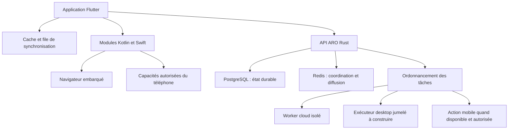

# ARO mobile — décision technologique et plan de réalisation

Analyse du dépôt et consultation des documentations officielles le 12 septembre 2026. Statut : proposition d’architecture, pas implémentation ni validation sur appareils. Hypothèse : application grand public Android et iOS, petite équipe, identité visuelle propre, navigateur intégré et continuité avec le desktop.

**Décision proposée : Flutter pour l’interface mobile, Kotlin et Swift pour les capacités natives, backend Rust existant conservé.** Valider cette décision avec une tranche verticale sur appareils avant de développer tous les écrans. Si le navigateur devient la surface principale du produit ou si Android devient la seule priorité avec beaucoup de services système, privilégier Kotlin/Jetpack Compose ; ajouter SwiftUI pour iOS selon les moyens.

## 1. Ce que le code permet réellement de réutiliser

ARO est un espace de travail IA hybride. Le parcours central associe conversation, projet, contexte, exécution, plan, artefacts et revue des changements. Le mobile doit permettre de capturer, consulter, superviser et agir dans les limites du téléphone ; les travaux sur un dépôt PC restent exécutés par une machine disposant de ce dépôt.

| Élément inspecté | Constat actuel | Conséquence mobile |
|---|---|---|
| `apps/desktop/package.json` | Tauri 2, Svelte 5, TypeScript | Conserver le desktop ; les composants Svelte ne deviennent pas des widgets Flutter |
| `apps/desktop/src/lib/api/transport.ts` | Nombreuses branches Tauri `invoke`, dont plans et fichiers | Ne pas déplacer ce transport entier sur téléphone ; distinguer API distante et capacités de l’appareil |
| `apps/api/src/main.rs` | Axum, routes versionnées, modes serveur et worker | Conserver un backend commun, API et workers déployables séparément |
| `packages/contracts`, `packages/api-client` | Types TS, client HTTP, renouvellement de session, lecteur SSE | Spécification de départ ; Flutter nécessitera un SDK Dart et des contrats indépendants du langage |
| `packages/ui-tokens/src` | Couleurs, typographie, espacements, ombres, animations | Exporter des valeurs sémantiques communes vers Dart et TS |
| `crates/aro-tools/src/lib.rs` | Shell, Python, Node, Git ; recherche et lecture web | Ces outils ne deviennent pas des capacités locales iOS/Android ; recherche HTTP ≠ navigateur interactif |
| `crates/aro-voice/src/lib.rs` | Adaptateurs lançant des exécutables locaux | Remplacer les adaptateurs par des SDK mobiles ou un service distant explicite |
| `crates/aro-agent-domain/Cargo.toml` | Dépendances de domaine sans Tauri | Candidat au partage Rust ciblé ; compilation mobile et interface FFI à démontrer |

Le dossier `apps` contient actuellement `api` et `desktop`. L’analyse du 10 septembre décrit une ancienne application Expo : elle ne correspond plus à l’arborescence inspectée aujourd’hui. Les scripts `verify-mobile-*` et contrats subsistent, mais ne prouvent pas l’existence d’un client mobile distribué.

### Quatre problèmes à intégrer au planning

1. **Streaming différé.** Dans `assistant_stream`, le serveur collecte les morceaux dans un vecteur, attend la génération et la persistance, puis construit `Sse::new(stream::iter(events))`. Le premier affichage distant attend donc la génération complète. Il faut un flux réellement incrémental et un résultat durable récupérable.
2. **Contrats à réconcilier.** `sendMessage` du SDK TS demande du JSON à `/assistant/stream`, alors que le handler inspecté retourne du SSE. Les scripts testent aussi `/v1/capabilities`, dont aucune route n’a été trouvée dans le routeur inspecté. Établir une matrice client/serveur et des tests HTTP réels avant génération du SDK Dart.
3. **Exécution distante incomplète.** Dans la branche `AgentActionType::Tool` du worker inspecté, la demande d’outil est enregistrée et ajoutée à l’historique, sans dispatch effectif d’outil dans cette branche. Ne pas promettre la parité avec le moteur desktop. Le dispatcher lance aussi des tâches en vidant la file sans plafond de concurrence visible à cet endroit.
4. **Appareils et reprise.** L’enregistrement `/devices` prend un identifiant, un nom et une plateforme ; cela ne constitue pas encore un protocole de jumelage et d’exécution distante. `agent_run_events` retourne une liste JSON ; le lecteur SSE TS inspecté ne gère pas de reprise par identifiant d’événement.

Ces observations viennent de la lecture du code, sans lancement du backend, campagne de tests ou mesure de performances pendant cette analyse.

## 2. Le contrôle du téléphone : définir une promesse réalisable

Le framework ne confère aucun privilège supplémentaire. Flutter peut appeler du Kotlin/Swift ; les mêmes autorisations OS et règles de distribution s’appliquent.

| Capacité | Android grand public | iOS grand public |
|---|---|---|
| Conversation, documents sélectionnés, caméra, microphone | Faisable avec les API et autorisations appropriées | Faisable avec les API et autorisations appropriées |
| Recevoir un lien/document depuis une autre app | Intents de partage | Share Extension |
| Exposer des actions ARO au système | Intents et intégrations Android | App Intents et Raccourcis |
| Naviguer dans ARO | Android WebView | WKWebView comme base portable |
| Observer un écran extérieur | MediaProjection avec consentement ; contenus protégés exclus selon le système | Scénarios ReplayKit encadrés ; pas de lecture universelle des autres apps |
| Cliquer dans n’importe quelle autre app | Capacités techniques d’accessibilité, avec restrictions fortes de distribution | Pas d’API publique générale pour une app ordinaire |
| Agent permanent en arrière-plan | Exécution limitée par le système, types de services et règles de démarrage | Exécution limitée aux mécanismes autorisés ; pas de daemon permanent général |

Google Play interdit explicitement l’usage de l’API d’accessibilité pour initier, planifier et exécuter des actions de manière autonome. Les scripts déterministes étroitement définis sont distingués ; l’exception vise de véritables outils d’accessibilité vérifiés. Un assistant généraliste vocal ne devient pas un outil d’accessibilité parce qu’il aide aussi certaines personnes handicapées. Une confirmation utilisateur ne doit pas être supposée suffisante pour rendre un agent généraliste conforme. [Politique officielle Google Play](https://support.google.com/googleplay/android-developer/answer/10964491?hl=en).

Sur iOS, construire autour des actions ARO exposées par App Intents, du partage, des liens et des intégrations partenaires. App Intents n’accorde pas le contrôle arbitraire des interfaces d’autres apps. Apple impose aussi des limites au code exécutable, aux conteneurs et aux usages en arrière-plan. [App Intents](https://developer.apple.com/documentation/appintents), [règles App Store](https://developer.apple.com/app-store/review/guidelines/).

La capture d’écran n’accorde pas le droit d’injecter des gestes. Android impose notamment un consentement pour chaque session MediaProjection aux applications ciblant Android 14 ou supérieur. [Documentation Android](https://developer.android.com/about/versions/14/behavior-changes-14).

**Promesse recommandée : ARO agit dans son espace, son navigateur et ses intégrations, et délègue les travaux lourds aux machines autorisées.** Une édition Android pour appareils administrés ou distribution spécifique serait un produit distinct à étudier ; elle ne supprime ni la sandbox ni les limites matérielles. Root, ADB et API de tests ne sont pas la base du produit grand public.

## 3. Comparaison des technologies

Appréciation d’architecture, sans classement chiffré artificiel ni benchmark réalisé.

| Choix | Atout pour ARO | Coût ou limite | Position |
|---|---|---|---|
| Flutter + modules natifs | Identité visuelle commune, interface personnalisable, une base UI Android/iOS | Dart ajouté à TS/Rust ; navigateur et extensions nécessitent du natif ; peu de réutilisation directe du frontend | Meilleur compromis proposé sous les hypothèses retenues |
| Kotlin/Compose + Swift/SwiftUI | Intégration directe aux SDK, cycles de vie et vues de chaque OS | Deux interfaces à construire et maintenir | Préférable si intégration système/navigateur domine ou équipe native dédiée |
| React Native + modules natifs | Réutilisation des contrats et utilitaires TS, vues natives | Réécriture des composants Svelte ; adaptation du transport et du streaming ; modules OS toujours nécessaires | Alternative très crédible si vitesse avec une équipe TS prime |
| Tauri mobile + Svelte | Réutilisation potentielle maximale du frontend et de Rust | UX tactile à repenser, plugins à qualifier, composition navigateur/interface WebView à mesurer | Pertinent pour un compagnon ; moins convaincant ici sans prototype des fonctions natives critiques |
| Kotlin Multiplatform | Partage de logique Kotlin avec interfaces natives possibles | Ajoute un troisième noyau métier si Rust reste central | À retenir seulement si Kotlin devient volontairement le socle mobile |

Flutter propose des échanges typés via Pigeon vers les plateformes. React Native propose aussi ses modules natifs, et Tauri des plugins Kotlin/Swift : aucun de ces frameworks n’est intrinsèquement privé d’accès aux API publiques. [Flutter](https://docs.flutter.dev/platform-integration/platform-channels), [React Native](https://reactnative.dev/docs/turbo-native-modules-introduction), [Tauri](https://v2.tauri.app/develop/plugins/develop-mobile/), [Kotlin Multiplatform](https://kotlinlang.org/docs/multiplatform-share-on-platforms.html).

Le risque spécifique à prototyper avec Flutter est la composition d’un navigateur natif, du clavier, des gestes et des panneaux Flutter. La documentation décrit plusieurs compromis de performance et d’accessibilité. Ne pas conditionner le produit à un mode expérimental disponible seulement sur certains appareils. [Platform Views Android](https://docs.flutter.dev/platform-integration/android/platform-views).

## 4. Architecture cible

Chaque tâche porte explicitement sa cible : téléphone, PC identifié ou cloud. Ne jamais interpréter un chemin PC comme un chemin du téléphone ou du serveur. Une machine éteinte apparaît indisponible ; pas de repli facturé silencieux. Les fichiers nécessaires au cloud doivent être transférés explicitement, avec leurs versions.

Un modèle de capacité doit exprimer : identifiant, version, plateforme, permission, disponibilité, cible, exigences de premier plan et confirmation éventuelle. Le serveur vérifie les droits ; l’exécuteur les revérifie juste avant l’action. États utiles : disponible, permission manquante, appareil hors ligne, non pris en charge, restreint par distribution.

Pour le jumelage : clé propre à l’appareil, approbation de l’association, connexion sortante authentifiée, droits limités par projet, révocation, expiration des commandes et journal d’exécution. Aucun port local Ollama ou shell exposé directement à Internet.

Pour la fiabilité : `commandId` idempotent, `runId`, événements ordonnés avec `eventId`, instantané durable, reprise depuis un curseur, transitions validées, bail d’exécution. Un accusé de réception ne signifie pas que l’action a réussi. Une annulation demandée reste distincte de l’arrêt confirmé. Les effets externes doivent être réconciliés avant un nouvel essai ; ne pas promettre un « exactly once » universel.

PostgreSQL reste la référence des données synchronisées. SQLite mobile conserve brouillons, historique téléchargé et opérations à synchroniser, isolés par compte et organisation. Définir versions, tombstones et conflits ; un diff exige une vérification de la version source avant application. La mémoire locale desktop existante ne devient pas automatiquement une mémoire mobile synchronisée.

Les tâches longues vivent dans un exécuteur durable. Une notification APNs/FCM invite à recharger l’état ; elle ne garantit ni réveil ni exécution. Une action nécessitant le téléphone au premier plan attend son retour. Le produit conserve les brouillons et contenus téléchargés quand l’IA payante est indisponible.

## 5. Outils proposés

| Besoin | Choix de départ | Règle |
|---|---|---|
| Interface | Flutter stable + Dart | Versions verrouillées après prototype ; composants ARO et adaptations iOS/Android |
| État et dépendances | flutter_riverpod | Organisation par fonctionnalité, effets hors widgets |
| Navigation | go_router | Liens profonds vers conversation, tâche et résultat |
| Cache | Drift sur SQLite | Migrations testées, isolation des comptes ; chiffrement à concevoir explicitement |
| Contrat réseau | OpenAPI versionné + SDK Dart généré | Contrat vérifié contre Axum ; TS généré depuis la même source ; couche SSE dédiée |
| Fonctions système | Kotlin, Swift, Pigeon | Petites interfaces typées, refus et révocation testables |
| Navigateur initial | webview_flutter, Android WebView et WKWebView | Module remplaçable ; extensions natives quand l’API du plugin ne suffit pas |
| Credentials | Keychain iOS, clés Android Keystore et stockage chiffré adapté | Pas de refresh token dans le cache métier ou les logs |
| Notifications | APNs et FCM | Signaux, état rechargé depuis le serveur, contenu sensible limité |
| Qualité | Tests Dart/widgets/golden + integration_test, tests Kotlin/Swift | Appareils réels, réseau instable et cycle de vie inclus |
| Développement | Android Studio, Xcode, Flutter DevTools, Instruments/Perfetto | Un Mac local ou CI macOS est requis pour la chaîne iOS |
| Livraison | CI existante étendue Android/macOS, signatures, canaux bêta | Contrats, tests et builds reproductibles avant publication |

Les outils de state management, routage, stockage et WebView sont documentés par leurs mainteneurs : [Riverpod](https://pub.dev/packages/riverpod), [go_router](https://pub.dev/packages/go_router), [Drift](https://drift.simonbinder.eu/), [webview_flutter](https://pub.dev/packages/webview_flutter). Leur assemblage proposé n’a pas été testé ici.

Réutiliser Rust par FFI seulement pour une logique réellement nécessaire hors serveur, par exemple règles pures ou traitement local. Commencer par l’API distante ; ne pas embarquer `aro-runtime` avec ses dépendances desktop pour maximiser artificiellement le partage. Le modèle local mobile est une piste ultérieure à mesurer en RAM, température, batterie et qualité, pas une conséquence automatique de Flutter.

## 6. Le navigateur comme véritable fonctionnalité

Une WebView affiche des pages ; elle ne fournit pas tout un navigateur. Il faut construire navigation, onglets, sessions, téléchargements, uploads, erreurs, permissions et reprise après destruction du processus. [Documentation Android WebView](https://developer.android.com/develop/ui/views/layout/webapps/webview).

Commencer avec un onglet actif, une barre d’adresse fiable, historique, partage vers une conversation et extraction choisie de contenu. Ajouter ensuite des onglets suspendus et un budget mémoire. Sur iOS, prendre WKWebView comme référence ; les moteurs alternatifs restent soumis à éligibilité et autorisations spécifiques, pas une base commune Android/iOS. [Règles Apple sur les navigateurs](https://developer.apple.com/app-store/review/guidelines/#software-requirements).

Séparer strictement la page web non fiable de l’API native. Aucun bridge universel exposant fichiers, credentials ou shell au JavaScript d’un site. L’agent propose une action structurée ; le moteur de permissions valide cible et origine. Les textes d’une page sont des données, pas des instructions privilégiées. Cookies, mots de passe et authentification restent dans leur environnement ; les connexions OAuth utilisent les mécanismes système adaptés, sans supposer qu’un fournisseur accepte une WebView.

L’automatisation du navigateur vient après la navigation : lecture de la page autorisée, proposition visible, validation des effets sensibles, exécution bornée, observation du résultat. Prévoir les iframes, redirections, CAPTCHA et pages incompatibles comme des cas d’arrêt. Une session navigateur cloud est distincte de celle du téléphone.

## 7. Expérience utilisateur proposée

Conserver l’identité ARO : palette, typographie, hiérarchie, calme visuel et mouvement cohérent. Adapter l’organisation au pouce et au clavier mobile.

- Trois destinations initiales : **Assistant**, **Activité**, **Espace**. Les réglages restent dans le profil ; le navigateur s’ouvre dans son contexte, puis gagne une destination dédiée si l’usage le justifie.
- Assistant : texte, bouton vocal, pièces jointes ; cible d’exécution visible quand elle compte ; retour immédiat « demande enregistrée » puis progression réelle.
- Activité : tâches en cours, attentes, résultats ; une erreur propose une action de reprise précise.
- Espace : projets et livrables ; aperçus adaptés au mobile ; diff unifié avec accès aux détails.
- Navigateur : page au premier plan et panneau assistant contextuel ; reprise manuelle immédiate.
- Tablettes : détails et conversation côte à côte si l’espace le permet.

La qualité premium doit se mesurer aussi au clavier sans saut, aux lecteurs d’écran, aux grandes polices, au retour Android, aux zones sûres iOS, à la réduction des animations et aux erreurs compréhensibles. Éviter les flous permanents coûteux ; la cohérence prime sur la quantité d’effets.

## 8. Plan de réalisation et critères de décision

Estimations de planification, non engagements : petite équipe avec une personne mobile expérimentée et du temps backend, appareils Android/iOS et Mac disponibles. Plusieurs travaux peuvent se chevaucher ; les inconnues backend et navigateur empêchent une date ferme.

| Étape | Effort indicatif | Livrable et critère de sortie |
|---|---|---|
| 0 — décision par prototype | 1–2 semaines | Flutter : conversation, clavier, WebView, panneau, voix, partage, retour arrière ; profilage Android milieu de gamme + iPhone physique |
| 1 — contrat et continuité | 2–4 semaines | Contrat réconcilié, SDK Dart, flux incrémental, identifiants durables, reconnexion, sessions et cache isolés |
| 2 — compagnon utile | 3–5 semaines | Demande → suivi → résultat ; projets, documents, brouillons hors ligne, notifications et retour au bon écran |
| 3 — navigateur utilisable | 3–6 semaines | Sessions, téléchargements/uploads, reprise, permissions, sécurité des origines ; pas de fuite du bridge natif |
| 4 — actions et exécuteurs | Chiffrage après prototype | Intégrations OS choisies, jumelage PC, outils réellement exécutés, consentements et résultats vérifiés |
| 5 — bêta de distribution | Continu puis stabilisation dédiée | Builds signés, installation/migration, crashs et performances suivis ; conformité des fonctions livrées |

L’étape 0 doit échouer utilement si le choix est mauvais. Objectifs proposés : interaction locale perceptible en moins de 100 ms, 60 images/s sur le téléphone cible pour les parcours choisis, absence de perte de brouillon après arrêt forcé, réponse correctement récupérée après 30 secondes sans réseau. Mesurer p95 des temps de trame, démarrage à froid, RAM, batterie et latence du premier fragment séparément de la latence du fournisseur IA. Aucun de ces objectifs n’est présenté comme atteint.

Si Flutter échoue surtout sur la composition du navigateur et des interactions système après correction ciblée, reproduire le même scénario en Kotlin/Compose avant de changer de technologie. Si Flutter passe, figer l’ADR et développer le produit ; ne pas multiplier les prototypes concurrents indéfiniment.

Tests indispensables avant bêta : expiration de session pendant une réponse, changement de compte sans fuite de cache, Wi-Fi vers réseau mobile, verrouillage et arrêt forcé, perte d’autorisation micro, PC hors ligne, commande dupliquée, annulation pendant un outil, diff devenu obsolète, redirection web vers une origine non autorisée et page tentant d’obtenir des privilèges natifs.

La montée en charge repose sur files durables, concurrence bornée par exécuteur et organisation, limites de coût, backpressure, stockage objet et observabilité. Conserver le monolithe modulaire Rust ; séparer davantage les services uniquement quand des mesures de charge ou d’isolation le justifient.
